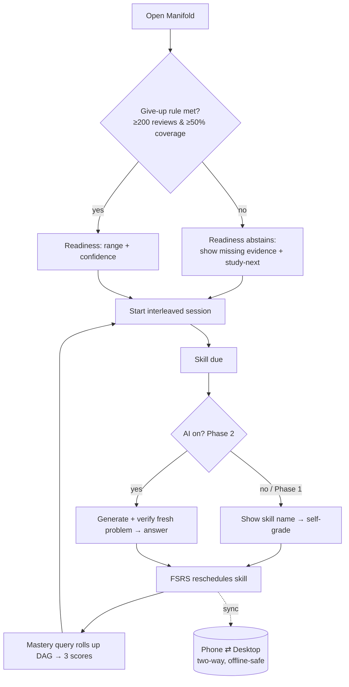
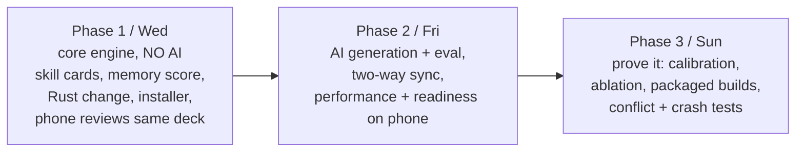
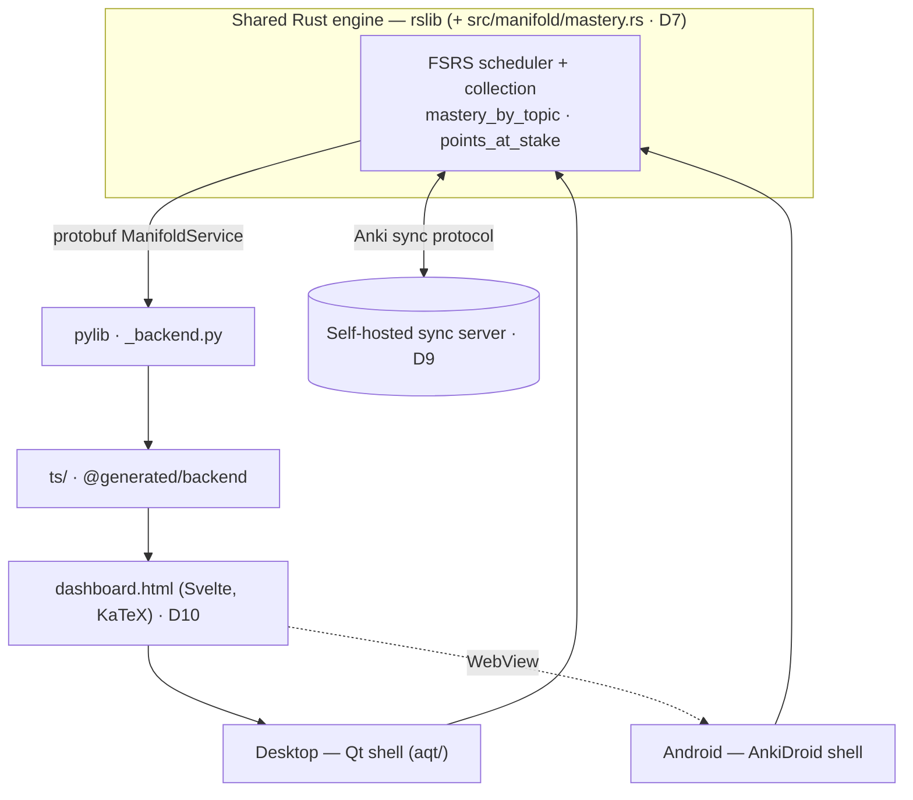
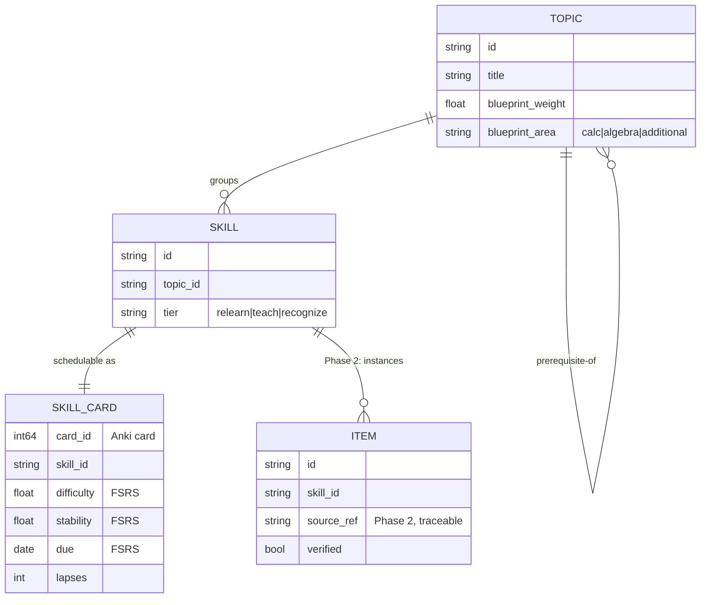
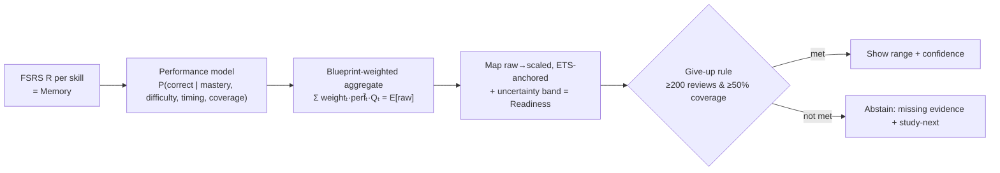
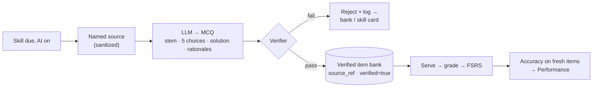

# Manifold — Product Requirements Document

> Manifold is a desktop + Android study app, forked from Anki, that turns its
> spaced-repetition **engine** into a GRE Mathematics Subject Test trainer for an
> AP-Calc-BC-ready undergrad — and reports three _honest, separate_ scores
> (memory, performance, readiness), each with a range and a rule for when it
> refuses to answer. This is the umbrella PRD; it indexes the specs in
> [`docs/manifold/`](docs/manifold/) and the decision log
> [`alternatives.md`](docs/manifold/alternatives.md).
>
> **Authority:** frozen initial plan, written before implementation. For current
> truth read [`docs/manifold/AGENTS.md`](docs/manifold/AGENTS.md) + the decision
> log; where a later decision conflicts with this doc, the decision wins.

## 1. Overview

- **Product:** _Manifold_ — the name nods to the test's subject matter and to "many
  paths to one surface": many skills rolling up to one readiness number.
- **Persona:** _Maya_, a 2nd-year math/physics undergrad fresh off AP Calculus BC.
  She knows ~45–55% of the blueprint cold (calculus, some linear algebra) and has
  never seen real analysis, topology, or abstract algebra. She has ~150 hours over
  a semester, studies at a desk and on her phone between classes, and wants to know
  _honestly_ whether she's on track for the median (~676). See D2.
- **Platform / stack:** AGPL-3.0 fork of Anki — Rust engine (`rslib`), Python lib
  (`pylib`), Anki's Svelte/TS web views for new UI, Qt desktop shell, Android via
  AnkiDroid, sync via Anki's self-hosted sync server. Rationale → D3, D8, D9, D10,
  D17.

## 2. Concept & audience

- **One-sentence pitch:** spaced repetition for _math skills you have to think
  through_, not facts you memorize — with a readiness number you can actually trust.
- **The core loop:** Manifold schedules **skills** (fine-grained problem patterns),
  not flashcards. When a skill comes due, the learner retrieves/works it, grades
  the attempt, and FSRS reschedules. Mastery rolls up the prerequisite DAG into the
  three scores. (Phase 1 shows the skill _name_; Phase 2 generates a fresh problem
  for it — D6, D14.)
- **The status-quo problem:** the GRE Math Subject Test has **no dedicated study
  app** (market research). General-purpose flashcards fail it because the test is
  _procedural_ — you must execute multi-step problems, not recall a fact (D3, D4).
- **Emotional payoff:** "I'm not guessing whether I'm ready — the app shows me the
  evidence, the range, and the one thing to study next."
- **Differentiators:** (1) schedules skills + serves fresh problem instances, so it
  can't be gamed by memorizing answers; (2) three separate honest scores with an
  explicit _give-up rule_ (D11, D12); (3) one shared Rust engine across desktop +
  phone with real two-way sync (D8, D9).

## 3. UX walkthrough (a session)

1. **Open Manifold (desktop).** Maya lands on the **Readiness dashboard**. Because
   she's done only 40 reviews and covered 30% of the blueprint, the readiness panel
   **abstains**: "Not enough evidence yet — 160 more reviews and 20% more coverage
   to a first estimate," with a coverage map and a "Study next: Sequences & series"
   nudge (D12).
2. **Start a session.** Manifold serves **interleaved** due skills across topics
   (D15). Phase 1: the card front reads "**Ratio test for convergence**." Maya
   recalls the method, reveals the reference, and grades herself _Good_. FSRS
   reschedules the skill (D4, D6).
3. **Keep going.** Cards mix calculus, linear algebra, and a recognition-only
   topology item. Each grade updates that skill's stability/difficulty.
4. **Check progress.** The dashboard now shows **Memory 0.82** (FSRS recall, with a
   band) for practiced skills, the **coverage map** filling in, and — once she
   crosses the give-up line — a provisional **Readiness: 540–600 (low confidence,
   38% covered)** (D11, D13).
5. **On the phone (Android).** Later, offline on the bus, she reviews 10 more skills
   in AnkiDroid on the same deck. Back online, it syncs; the desktop reflects the
   new reviews with none lost or double-counted (D8, D9).
6. **Phase 2 (AI on).** A due skill now serves a **freshly generated, verified**
   problem with multiple choices; Maya solves it, and her accuracy on _new_ items
   starts to feed the **Performance** score — exposing the gap between what she
   remembers and what she can do (D14, D11).



## 4. UI direction

- **Feel:** calm, instrument-panel honesty — this is a measurement tool, not a
  hype machine. Dense but legible; ranges and uncertainty are visually first-class,
  never hidden behind a single big number.
- **Type/math:** all mathematical expressions are **typeset** (MathJax/KaTeX), on
  cards and in the dashboard — no ASCII math.
- **Color:** a restrained palette; reserve saturated color for confidence/coverage
  signals (e.g., abstaining = neutral grey, not alarm red).
- **Motion:** minimal; never block the screen (see §7).
- **Not in this phase:** gamification streaks/leaderboards, social features, themes.

## 5. Strategy & philosophy

- **Why skills, not flashcards (D3, D4):** the test rewards executing patterns on
  unseen problems. Scheduling the _pattern_ and serving a _fresh instance_ each
  time is what separates learning from memorizing an answer key.
- **Why three depths (D5):** desirable difficulties only help when surmountable.
  Relearn what Maya has, teach-then-master the high-ROI new core, and only aim for
  _recognition_ on the analysis/topology tail — which is exactly where the median is
  reachable without the unreachable top-decile mastery.
- **Why honesty is the product, not a disclaimer (D11–D13):** a readiness number
  with no evidence behind it is "a guess in a nice font." Manifold grades the
  _steps of the bridge_ (calibrated memory → fresh-item performance → score
  mapping) and refuses to project when it lacks data.
- **Phasing logic (maps to the assignment's deadlines):**



## 6. Engagement philosophy

Manifold's "habit" is the daily due queue (FSRS), ordered by points-at-stake so the
highest-value skill surfaces first (D7). Retention, not session length, is the
metric; a harder-feeling interleaved session is a _positive_ signal, not a failure
(D15). The dashboard's job is to make progress legible and to be honest when it
isn't there yet.

## 7. Performance / quality targets

Measured on the shared 50,000-card reference deck; report p50, p95, and worst case
(assignment §10). Owned by [`spec-engine`](docs/manifold/spec-engine.md) and
[`spec-mobile-sync`](docs/manifold/spec-mobile-sync.md).

| Action                    | Target                                          |
| ------------------------- | ----------------------------------------------- |
| Button press acknowledged | p95 < 50 ms (desktop + phone)                   |
| Next card after grading   | p95 < 100 ms                                    |
| Dashboard first load      | p95 < 1 s                                       |
| Dashboard refresh         | p95 < 500 ms, no screen freeze                  |
| Sync of a normal session  | < 5 s on a normal connection                    |
| App cold start            | < 5 s desktop, < 4 s phone                      |
| Any frame block           | never > 100 ms                                  |
| Crash test                | 0 corrupted collections (both platforms)        |
| Memory on 50k cards       | under a stated limit, desktop + mid-range phone |

## 8. Architecture & app structure

> The consolidated structural map: how Manifold layers onto Anki, the domain model,
> where state lives, the one engine change, and the data flows for the three scores,
> AI generation, and sync. Full detail + rationale live in the specs (§12) and the
> decision log; this section is the single place to see how the pieces fit.

### 8.1 The stack — one engine, many shells

Manifold **reuses Anki's engine** (FSRS scheduler + collection + note/card model)
and adds a thin teaching layer; it does **not** rewrite the scheduler (D3). The
_same_ `rslib` powers desktop and phone, and Manifold's change rides inside it, so
both shells inherit it for free (D7, D8).



| Layer          | Path                        | Manifold's addition                                                                                   |
| -------------- | --------------------------- | ----------------------------------------------------------------------------------------------------- |
| Rust engine    | `rslib/`                    | new module `src/manifold/mastery.rs`: `mastery_by_topic` (primary) + `points_at_stake` (stretch) (D7) |
| Protobuf / IPC | `proto/anki/manifold.proto` | new `ManifoldService`; a new `.proto` needs a full `just check`, not just `cargo check`               |
| Python lib     | `pylib/`, `pylib/rsbridge`  | `_backend.py` exposes snake_case `mastery_by_topic(...)`                                              |
| Web frontend   | `ts/`, `@generated/backend` | new `dashboard.html` mediasrv page (Svelte/TS), math typeset with KaTeX (D10)                         |
| Desktop shell  | `aqt/` (Qt)                 | hosts the Svelte dashboard + Anki's reviewer                                                          |
| Mobile shell   | AnkiDroid (Android)         | runs the same `rslib` (cross-compiled); WebView reuses `dashboard.html` (D8)                          |
| Sync           | Anki protocol               | self-hosted sync server; no custom protocol (D9)                                                      |

### 8.2 Domain model — skills, topics, the DAG, items

The schedulable unit is a **skill** — a fine-grained pattern (e.g.
`calc.related_rates.similar_triangles`), not a flashcard and not a broad topic (D4).
Each skill belongs to exactly one **topic** (a node in a prerequisite **DAG**) and
carries a **tier** (`relearn | teach | recognize`, D5). FSRS schedules the skill's
card exactly as in Anki — there is no parallel scheduler.



- **Topic (DAG node):** `blueprint_weight` (share of exam points) + prerequisite
  edges. The DAG is acyclic, ~16–17 nodes; `coverage` = fraction of in-scope nodes
  with ≥1 authored skill (the coverage map, assignment 7c).
- **Skill:** belongs to one topic, carries a tier.
- **SkillCard:** the Anki card for a skill; carries FSRS `difficulty/stability/due`
  - `lapses`. Phase 1 renders the skill _name_; Phase 2 renders a generated item.
- **Item (Phase 2):** a generated MCQ — `stem`, `choices[5]`, `correct_index`,
  `solution`, `distractor_rationales[]`, `source_ref` (named, traceable), `verified`,
  `verifier_report`, `generated_by/at`.

### 8.3 Where state lives — no schema fork

A deliberate constraint (D7, D9): Manifold adds **read/aggregation logic, not new
synced tables**, so Anki's sync + undo keep working untouched — the lowest-risk way
to change the engine.

| What                                    | Where                                                         | Notes                                                                                                                                                                                                      |
| --------------------------------------- | ------------------------------------------------------------- | ---------------------------------------------------------------------------------------------------------------------------------------------------------------------------------------------------------- |
| Topic / skill / tier identity           | Anki **tags** — `mf::topic::*`, `mf::skill::*`, `mf::tier::*` | syncs with the collection for free (D9)                                                                                                                                                                    |
| DAG edges, blueprint weights, ETS table | **`mf_blueprint.json`**                                       | versioned content file shipped with the deck; loaded into an in-memory graph in Rust at collection open; static reference data, identical on both platforms. **Status: to be authored** (current focus #2) |
| FSRS scheduling state                   | the Anki card                                                 | unchanged — we _read_ `R`, we don't retune it (D3)                                                                                                                                                         |
| Verified item bank (Phase 2)            | rides the collection                                          | so generated items sync (D9, D14)                                                                                                                                                                          |
| The three scores                        | **derived, not stored as truth**                              | a small cache row holds the last-computed readiness + inputs for "last updated" + the evidence audit                                                                                                       |

### 8.4 The engine change — the one required Rust change (D7)

**Primary — `mastery_by_topic` (RPC).** One pass over the card table, bucket by
topic via the in-memory DAG, roll up per node. Reuses Anki's FSRS functions to
compute `R` (no reimplementation); nothing recomputes per-card in Python/TS. Target
p95 < 1 s on 50k cards (§7). This is the only source the dashboard reads from.

```rust
// rslib/src/manifold/mastery.rs  (new module)
pub struct TopicMastery {
    pub topic_id: String,
    pub mastered: u32,     // skills with recall ≥ mastery_threshold
    pub total: u32,        // authored skills in this topic
    pub avg_recall: f32,   // mean FSRS R over the topic's cards
    pub avg_stability: f32,
    pub coverage: f32,     // authored / blueprint-expected
}

pub fn mastery_by_topic(col: &mut Collection, threshold: f32)
    -> Result<Vec<TopicMastery>>;
```

**Stretch — `points_at_stake` queue.** A due-card ordering by
`priority = blueprint_weight(topic) × weakness(skill)`, where `weakness = 1 − R`, so
the highest-value-at-risk skills surface first (§6). It **reorders what's already
due; it does not reschedule** — this is what keeps undo + FSRS interval validity
safe.

**Protobuf surface** (`proto/anki/manifold.proto`):

```proto
service ManifoldService {
  rpc MasteryByTopic(MasteryRequest) returns (MasteryResponse);
  rpc BuildPointsAtStakeQueue(QueueRequest) returns (QueueResponse);
}
message MasteryRequest { float mastery_threshold = 1; }
message TopicMastery {
  string topic_id = 1; uint32 mastered = 2; uint32 total = 3;
  float avg_recall = 4; float avg_stability = 5; float coverage = 6;
}
message MasteryResponse { repeated TopicMastery topics = 1; }
```

**Contract:** ≥3 Rust unit tests + 1 Python integration test through `_backend`;
undo-safe; no collection corruption (AC 2).

### 8.5 The three-score pipeline (derived on top of the rollup)

The three scores are **derived**, never blended, and each is shown with a range
(D11). They consume the `mastery_by_topic` aggregates — they don't recompute card
state.



- **Memory** = FSRS recall `R` per skill, aggregated via `mastery_by_topic`; shown
  as value + band.
- **Performance** = a calibrated logistic
  `σ(β₀ + β₁·stability + β₂·(1−difficulty) + β₃·avg_time_z + β₄·tier)` over features
  available AI-free, fit on **held-out** graded items (Phase 2). Until then it reads
  "not yet measured" — never copied from Memory. The **paraphrase test** proves it
  isn't echoing memory.
- **Readiness** = expected raw-correct `Σ weightₜ·perf̂ₜ·Qₜ` mapped to the 200–990
  scale via a monotonic function **anchored on the real ETS distribution** (mean 676
  ≈ 50th pct, SD 154, n=7,452); the raw→scaled tables aren't published, so this is an
  explicit approximation (D13). Always a range + confidence + % covered.
- **Give-up gate:** no readiness number until **≥200 graded reviews AND ≥50%
  coverage** (D12); below the line the card shows missing evidence + the single best
  next skill, never a scalar. There is no code path that emits a bare readiness
  number (AC 20–21).

### 8.6 AI generation pipeline (Phase 2 — bank-first, AI-off by default)



The runtime review path is **bank-first by design**: it serves the pre-seeded
verified bank or the Phase-1 skill card, so the app runs fully **AI-off** (D6, D14;
AC 23). When online, generation fills the bank _ahead_ of the due moment. Every
served item is source-traced; the **verifier** (correctness via SymPy / a
second-model cross-check, non-contradiction, teaching quality, injection-safety) is
mandatory and independent of the generator; only `verified=true` items enter the
bank. Eval runs against a keyword/vector baseline on a ≥50-item gold set with a
pre-set cutoff (AC 7–9).

### 8.7 Interleaving — the study-feature toggle

Interleaving is a **session-builder policy flag** (`interleave: bool`) over the due
queue: ON draws consecutive items from _different_ DAG topics (composing with
points-at-stake), OFF serves them blocked by topic. It changes only ordering — no
synced schema — which is what makes the three-build ablation (full / feature-off /
plain Anki) a clean one-variable test (D15).

### 8.8 Sync & the conflict rule

Both shells call the identical `rslib` and sync via Anki's protocol to a self-hosted
server (D9). Disjoint offline reviews merge so all land exactly once. **Conflict
rule (Manifold's, written down):** when the _same_ card is reviewed on both devices
offline, the review with the **later real-world timestamp wins**; the loser is kept
in the revlog but does not double-count the card's scheduling. Timestamps are
normalized to the server clock on sync to defend against a wrong phone clock (edge
cases #11, #12).

### 8.9 UI surfaces

- **Readiness dashboard** — `dashboard.html`, a Svelte mediasrv page (D10) shared by
  desktop (Qt) and phone (AnkiDroid WebView). Reads **only** from `mastery_by_topic`
  (one RPC) so first load is p95 < 1 s. Renders three score cards (value+range), the
  coverage map, and the give-up state. All math typeset (KaTeX).
- **Reviewer** — Anki's native reviewer; Phase 1 shows skill-name cards, Phase 2
  swaps in a generated MCQ with a "source" affordance for traceability.
- **Session settings** — the interleave/blocked toggle (desktop + phone).
- **Internal author/eval views** — gold-set counts + baseline comparison; the
  three-build ablation results with confidence intervals.

### 8.10 Repo & docs layout (D16)

- `PRD.md` (root) — this umbrella contract.
- `docs/manifold/` — the five `spec-*.md`, the decision log (`alternatives.md`), and
  Manifold's `AGENTS.md` front door (current truth / overrides).
- `mf_blueprint.json` — DAG edges + blueprint weights + ETS table (to be authored).
- **Two `AGENTS.md`:** Anki's at the repo root (build mechanics + `just` recipes) vs
  `docs/manifold/AGENTS.md` (Manifold authority). Build via `just`; a new `.proto`
  needs a full `just check`. License: **AGPL-3.0-or-later**, crediting Anki (some
  parts BSD-3-Clause) (D17).

## 9. Out of scope (this release)

- Real-student validation of the readiness number against actual practice-test
  scores — the bonus Step 4 (D11, D13).
- iOS companion (D8).
- Other exams (MCAT/LSAT/GMAT/USMLE) (D1).
- The top-decile (~850+) score tier and proof fluency / mathematical maturity
  ([`BRAINLIFT.md`](BRAINLIFT.md) out-of-scope).
- Gamification, social, themes (§4).
- Real-time (sub-second push) sync — Anki's session sync is the bar; real-time is a
  stretch idea only (assignment §13).

## 10. Acceptance criteria

> Shipped when all of the following are observable in the running apps. Bucketed by
> the assignment's deadlines.

### 10.1 Core engine & desktop (Phase 1 / Wed)

1. Anki forks and builds from source; commit hash + clean-build recording exist.
2. The **Rust change** works end-to-end: the mastery-by-topic query RPC returns
   per-DAG-node stats, with ≥3 Rust unit tests + 1 test calling it from Python, and
   a demonstrated undo with no collection corruption.
3. A review loop runs on the GRE-math deck using **skill cards** (front = skill
   name), self-graded, FSRS rescheduling.
4. A **Memory** score is shown with a range and the give-up rule applied.
5. A desktop **installer** runs on a clean machine (recording).
   → Spec: [`spec-engine`](docs/manifold/spec-engine.md), [`spec-scoring`](docs/manifold/spec-scoring.md). Decisions: D3, D4, D6, D7, D11, D12.

### 10.2 Mobile parity (Phase 1 / Wed)

6. An AnkiDroid-based build runs on a real device/emulator, loads the GRE-math
   deck, and runs a real review session on the **shared Rust engine** (two-way sync
   not yet required).
   → Spec: [`spec-mobile-sync`](docs/manifold/spec-mobile-sync.md). Decisions: D8.

### 10.3 AI layer (Phase 2 / Fri)

7. When AI is on, a due skill serves a **freshly generated, verified** problem;
   every served item traces to a named source.
8. An **eval** runs before any item reaches a student: accuracy + wrong-rate on a
   held-out gold set, with a pre-set cutoff that blocks failing items.
9. A side-by-side shows the AI **beats a keyword/vector baseline**.
10. The app still produces a score with **AI switched off** (serves skill cards /
    pre-seeded bank).
    → Spec: [`spec-ai-generation`](docs/manifold/spec-ai-generation.md). Decisions: D6, D14.

### 10.4 Sync & the three scores on phone (Phase 2 / Fri)

11. **Two-way sync** works: a card reviewed on the phone appears on the desktop and
    vice-versa, with no lost or double-counted reviews; offline review syncs on
    reconnect.
12. The phone shows the **three scores** with ranges and obeys the give-up rule.
    → Spec: [`spec-mobile-sync`](docs/manifold/spec-mobile-sync.md), [`spec-scoring`](docs/manifold/spec-scoring.md). Decisions: D9, D11, D12.

### 10.5 Proof & ship (Phase 3 / Sun)

13. **Memory** is calibrated: a reliability chart + Brier/log-loss on held-out
    reviews.
14. **Performance**: accuracy on held-out exam-style items; the **paraphrase test**
    reports the memory↔performance gap.
15. **Readiness**: the mapping method is written down and shown as a range.
16. The **interleaving ablation** runs three builds at equal study time with a
    pre-registered metric; results (including null/negative) are reported.
17. A **leakage check** script scans training data for test items and reports clean.
18. Packaged **desktop installer + Android build**; sync **conflict** handling is
    correct and documented; both apps run **AI-off** and still give a score.
19. A one-command **benchmark** prints p50/p95/worst for the §7 actions on the 50k
    deck.
    → Spec: [`spec-scoring`](docs/manifold/spec-scoring.md), [`spec-study-feature`](docs/manifold/spec-study-feature.md), [`spec-ai-generation`](docs/manifold/spec-ai-generation.md). Decisions: D11, D13, D14, D15.

### 10.6 Scope / negative criteria (must be observably ABSENT)

20. **No** blended single "% ready" number anywhere — only three separate scores,
    each with a range (D11).
21. **No** readiness number shown below the give-up line (D12).
22. **No** AI output without a traceable named source (D14).
23. **No** live model call on the runtime review path required for the app to
    function (it must run fully AI-off) (D6, D14).
24. **No** scheduler in JS/Swift — the engine is shared Rust (D3, D8).

## 11. Cross-cutting edge cases

The assignment's adversarial list (§10), each mapped to the AC/spec that resolves it.

| #  | Edge case                                    | Resolved by                                                                     |
| -- | -------------------------------------------- | ------------------------------------------------------------------------------- |
| 1  | Memorizes card wording, fails reworded items | Skill scheduling + fresh instances + paraphrase test (AC 14; D4, D14)           |
| 2  | Huge deck skips a high-weight topic          | Coverage map + give-up rule abstains (AC 4, 21; D5, D12)                        |
| 3  | Two cards state opposite facts               | Verifier rejects contradictions (AC 8; D14)                                     |
| 4  | Source with hidden text (prompt injection)   | Generation input sanitization + verifier (AC 8; D14)                            |
| 5  | Taps Good without reading                    | FSRS self-correction over time; Phase-2 item accuracy cross-checks (AC 14; D11) |
| 6  | Topic with almost no history                 | Per-skill confidence low → readiness widens/abstains (AC 21; D12, D13)          |
| 7  | Accurate but too slow                        | Timing is a Performance input (AC 14; D11)                                      |
| 8  | AI cards correct but useless                 | Gold-set "good teaching" count + cutoff (AC 8; D14)                             |
| 9  | Score jumps from leaked test data            | Leakage check script (AC 17; D14)                                               |
| 10 | AI offline / rate-limited / broken output    | AI-off path serves skill cards/bank (AC 10, 23; D6, D14)                        |
| 11 | Same card reviewed on two devices offline    | Documented conflict rule (AC 18; D9)                                            |
| 12 | Phone offline mid-sync / wrong clock         | Anki sync resumes; document clock handling (AC 11; D9)                          |
| 13 | Crash mid-review                             | 0 corrupted collections (AC 18; D7)                                             |
| 14 | Corrupt / 50k / broken-image deck            | Engine robustness + benchmark deck (AC 19; D7)                                  |

## 12. Companion documents

| Doc                                                         | Owns                                                                                         |
| ----------------------------------------------------------- | -------------------------------------------------------------------------------------------- |
| [`spec-engine`](docs/manifold/spec-engine.md)               | Rust mastery-by-topic query + points-at-stake queue; skill/DAG data model; review unit; perf |
| [`spec-scoring`](docs/manifold/spec-scoring.md)             | The three scores, calibration, give-up rule, readiness→scale mapping, paraphrase/leakage     |
| [`spec-mobile-sync`](docs/manifold/spec-mobile-sync.md)     | AnkiDroid companion, sync reuse, offline, conflict rule                                      |
| [`spec-ai-generation`](docs/manifold/spec-ai-generation.md) | Phase-2 generation, verifier, item bank, gold-set eval vs baseline                           |
| [`spec-study-feature`](docs/manifold/spec-study-feature.md) | Interleaving + the 3-build ablation experiment                                               |
| [`alternatives.md`](docs/manifold/alternatives.md)          | The decision log (D1–D17)                                                                    |
| [`AGENTS.md`](docs/manifold/AGENTS.md)                      | Front door / current truth / overrides                                                       |

---

<sub>Created with the `plan-prd` skill · maintained with `log`.</sub>
