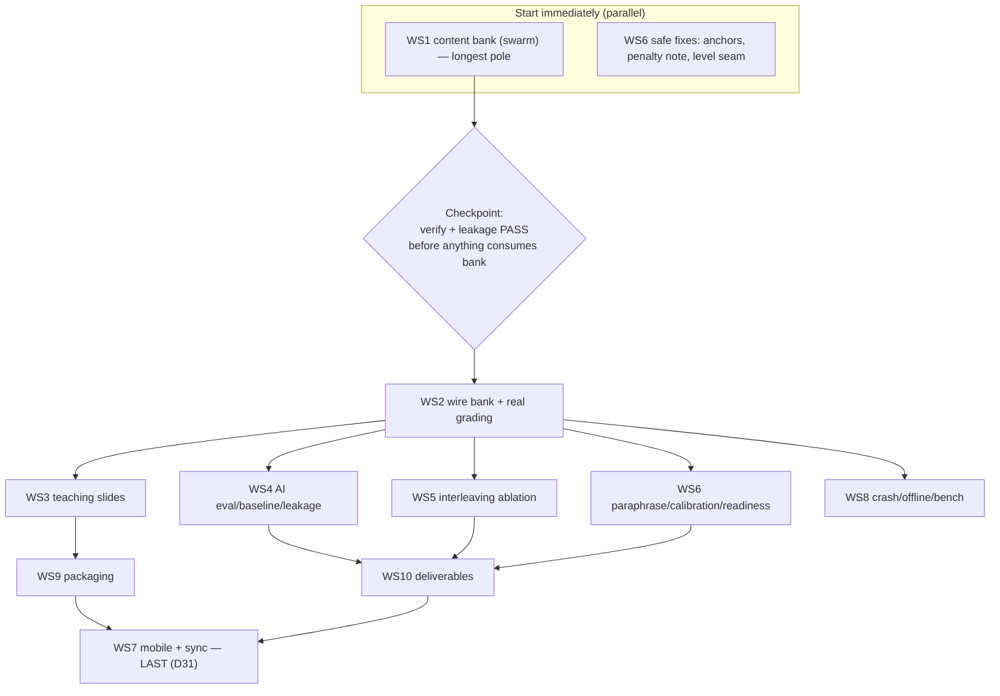

# Plan: Overnight buildout — from Phase-1 core to a submittable, exceptional-tier Manifold

> Execution plan for finishing Manifold in one focused push. Scope: everything
> from the current Phase-1 core to a graded-rubric-complete submission, plus the
> "exceptional tier" strategy shift (target the top decile, not just the median).
> This is an **execution artifact** — work the checklists top to bottom within a
> workstream; parallelize across workstreams per §Execution order.
>
> **Authority:** planning doc, later than the PRD/specs. Where it changes intent,
> it proposes decisions **D26–D43** (§Decisions) to be appended to
> [`alternatives.md`](alternatives.md); it does not edit frozen specs. Grounded in
> the 5-form practice-test forensics, the verified source review, and a full
> repo-state audit (Jul 2026).

## 0. Why this plan exists (the strategy shift)

The frozen BRAINLIFT capped the goal at the **median** by declaring the
non-calculus half "mathematical maturity, out of scope." Forensics on five real
ETS forms (GR8767, GR9367, GR9768, GR0568, GR1268) refute that: **~98% of items —
including the hard tail — are a drillable recognition library** (standard
theorems, counterexamples, classifications), and only **~2–3 items per form** are
genuine live-proof reasoning. Evidence review confirms the _components_ of
"maturity" are trainable fast (Schoenfeld & Herrmann 1982; Bisra 2018; Hodds
2014; Alfieri 2013; Quilici & Mayer 1996), bounded by a logarithmic effort→score
curve near the top (Messick & Jungeblut 1981) and individual differences
(Peng 2019; Wai 2005).

**Evolved goal:** carry a calculus-ready student into the **top ~10–15%
(~800–860 scaled)**, conceding only the ~2–3 deep-proof items and the
top-percentile tax, and be _honest_ about that residue. See **D30**.

## 1. Current state (audited)

**DONE (Phase-1 core — solid):**

- Rust engine: `get_topic_graph`, `build_session_queue` (points-at-stake,
  tier-major, always-on topic interleaving, prereq gating), mastery rollup,
  performance = `Review`-kind only, teaching levels. 16 Rust + 2 Py tests,
  undo-safe (read-only). `rslib/src/manifold/{mastery,session,service,blueprint,mod,test}.rs`.
- Proto: `ManifoldService` with 2 RPCs (`proto/anki/manifold.proto`).
- Three scores in TS (`ts/lib/manifold/scoring.ts`): memory, performance,
  readiness (projected ETS-anchored range), give-up rule (200 independent + 50%
  coverage). 25 TS unit + 3 e2e tests.
- Dashboard + session UI wired (`ts/routes/manifold*`, components).
- Blueprint: 33 topics, weights/tiers/prereqs/anchors (`rslib/src/manifold/blueprint.json`).
- Benchmark: `manifold/bench/bench_mastery.py` (p50/p95/worst on `get_topic_graph`).

**STUB / PLACEHOLDER:**

- `PROBLEMS_ARE_PLACEHOLDER = true`; `getProblem()` returns skill name + empty
  choices; grading = "A is always correct" (`ts/lib/manifold/session.ts`).
- Teaching level = label only; same placeholder slide at every level.
- Interleaving = always on; no blocked/interleaved toggle for the ablation.
- `BackendManifoldService` = empty proto stub.

**MISSING:** real MCQ content (0 items); AI generation + verifier + gold set +
eval + baseline + leakage; the paraphrase test; calibration; the study-feature
3-build ablation; **all mobile/Android + phone sync**; crash/offline scripts;
one-command bench; installer rebrand + clean-device check; deliverables
(BRAINLIFT rewrite, model descriptions, demo video).

**Keystone dependency:** content (WS1) unblocks WS2–WS6. Do it first and biggest.

## 1b. Cross-cutting engineering rules (non-negotiable)

Apply to every workstream:

- **No hard-coding, no fallbacks, no mocks, no silent defaults.** If a required
  input is missing (env var, bank file, source, API key, RPC field), **fail loudly
  and stop** with the real error. Never substitute placeholder/fake data to keep
  going.
- **The one sanctioned placeholder (`PROBLEMS_ARE_PLACEHOLDER`) is removed in
  WS2** — do not add new ones. Missing content → the app **abstains** (give-up
  rule); it never invents a problem or a score.
- **Generated content is never trusted, only verified.** Unverifiable item →
  rejected + logged (`rejects.jsonl`), never banked. No "probably correct" path.
- **No fabricated/unattributable numbers** anywhere (readiness, percentiles,
  eval). If a source table can't be cited, abstain (mirrors D11/D12 + standing rule).
- **Determinism where it matters:** the verifier core is pure SymPy/NumPy (no LLM
  in the correctness path); any randomness (e.g., `correct_index`) is seeded/logged.
- **Cognitive-debt guard (D42, Hendrick).** The active ingredient is the _learner's
  own_ retrieval/generation: **never reveal an answer before an attempt**, keep
  self-explanation and practice reps generative, and never collapse a generative
  step into recognition to make grading easier (a lethal mutation). AI adapts
  difficulty and gives feedback; it does not do the thinking for the learner.
- **Secrets never in the repo.** API keys (e.g., `OPENAI_API_KEY`) load from a
  **gitignored** `.env` / shell env / OS keychain, read as
  `os.environ["OPENAI_API_KEY"]` — **fail loudly if missing** (no default, no
  hard-coded key). The repo ships public AGPL (§12), so a committed key is scraped
  and auto-revoked within minutes; it also persists in git history. Add `.env` to
  `.gitignore`; **never** paste a live key into a doc/prompt/commit, and rotate any
  key that has been exposed.
- **Unattended autonomy (D35).** During the overnight run, agents **never stop to
  ask** — decide with best judgment and **log the decision**. This does **not**
  loosen no-fabrication: a real blocker (missing key, unpassable gate, missing
  gold-set PDFs) is **logged loudly, quarantined, and skipped**, and the run
  continues on everything workable — never faked, never halted-on. Blockers +
  judgment calls collect in `docs/manifold/overnight-report.md` for the morning.

### Practice-test firewall (leakage + copyright)

The five ETS practice forms are **evaluation material, not generation input**:

- Use them **only** as the held-out **gold set** (7f) and the **leakage-check
  target** (7e). **Never** put them (or near-copies) into the generation prompt or
  the item bank — that triggers the "leaked data = 0" auto-zero _and_ contaminates
  the eval.
- **Do not commit them** to the public AGPL repo (ETS copyright + leakage hygiene).
  Store locally under `manifold/content/eval/heldout/` and **gitignore** it; the
  gold-set/leakage scripts read that local path.
- Deriving _pattern coverage and difficulty targets_ from them (as the forensics
  did) is fine — that's abstraction, not copying. Feeding raw items to the model is
  not.
- **Status:** the PDFs were purged from Trash and are **not currently on disk** —
  re-provide them into `manifold/content/eval/heldout/` to build the gold set and
  run the leakage check. Until then WS4's gold-set/leakage tasks are **blocked**
  (fail loudly; do not fabricate a gold set).

## 2. Workstreams

Legend: `[ ]` todo · deps in **Depends** · `AC:` acceptance · rubric % noted.

---

### WS1 — Content generation pipeline (keystone) · feeds 20%+15%+15%

Offline authoring build → static verified bank → AI-off runtime. See **D28**.

New dir `manifold/content/generation/`:

- [ ] `parse_patterns.py` — parse `docs/manifold/problem-types/*.md` (519
      patterns) into records `{id, topic_id, skill_id, approach, difficulty}`; each is
      a **named source** for `source_ref`.
- [ ] `generate.ts` — **swarm Pass 1** (direct structured-output calls, _not_
      agentic subagents): `create({tasks: patterns × {easy,med,hard}})`, `run` emits
      the `Item` (`stem, choices[5], correct_index, solution, distractor_rationales[],
  source_ref, tier_tag`) **plus a machine-checkable `check` block**
      (`type: equiv|numeric|antiderivative|eigen|det|rank|count|prob_exact|second_model`).
      Randomize `correct_index`.
- [ ] `verify.py` — **the primary correctness gate, deterministic (no LLM), for
      the ~80–90% computable majority** (D32): (1) structural; (2) ground-truth
      recompute via **SymPy symbolic ∧ mpmath/NumPy numeric — require agreement**
      (catches CAS bugs); (3) single-answer (evaluate all 5 choices, exactly one
      correct). **If SymPy can't decide → reject + log, never assume.** Emits
      `verifier_report`. Exact brute force for discrete (number theory/combinatorics).
- [ ] `smt_check.py` (Z3) — the **decidable** "must be true" / counterexample
      middle (find a model or prove universal). **Lean rejected** (D32): its
      formalization step relocates trust to an untrusted LLM translation and is
      overkill for MCQ correctness.
- [ ] `crosscheck.ts` — **swarm** Gate 4, _only for the non-computable tail_ SymPy
      and Z3 can't judge: a _different_ model solves blind; require ≥2 agreement.
      **Dropped for SymPy/Z3-verified items** (no second model needed for a proven
      answer).
- [ ] `quality_judge.ts` — **swarm** Gate 5a: rubric (distractor plausibility,
      solution clarity, tier match) — quality only, not correctness.
- [ ] `leakage_check.py` — Gate 5b: embeddings + n-gram near-dup vs gold set and
      the 5 practice PDFs. Reject matches (protects "leaked data = 0").
- [ ] `build_bank.py` — orchestrate all gates; write `item_bank.json` (verified
      only) + `rejects.jsonl` (with reasons — **fail loudly, never ship unverified**) +
      a coverage report (verified count per topic/skill/tier).
- [ ] `import_bank.py` — extend `import_seed.py`: load bank into the collection so
      items ride sync (D9/D14). Items reference their skill (tags).
- **Cheap recipe (default, see §Cost):** cheap model + low reasoning + direct
  calls + prompt-cache the source + batch API + regenerate-only-rejects
  (`filter: {verified exists:false}`); flagship _only_ for the T3 conceptual tail.
- **Authoring order (ROI):** calculus (mastery incl. hard low-P+) → linear
  algebra → abstract-algebra classifications / probability / combinatorics /
  complex analysis / number theory → real-analysis/topology counterexample deck.
- **Two authoring modes** (verification is weakest where generation is riskiest):
  free-generate + SymPy-verify the computable bulk; **template/curate** the
  conceptual/counterexample tail from the catalog + cross-check + human spot-check.
- **Variability of practice (D42):** a skill's instances must **vary surface
  features** (cover story, parameters, representation), not just the numbers — this
  is what builds transferable _deep-structure_ recognition (Quilici & Mayer; varied
  practice), and it also strengthens the leakage firewall against near-duplicates.
- [ ] **Skill-level prerequisite edges (D40):** author a within-topic skill graph —
      each skill lists prerequisite skills/knowledge atoms (e.g. `order_p` ← {Lagrange,
      element_order, cyclic_generator}) — shipped in `blueprint.json`/content for the
      engine to gate on (finer than the 33-topic DAG).
- **AC:** ≥ ~1,200 verified items, ≥ blueprint `expected_skills` coverage per
  topic, every item has a `source_ref` and a passing `verifier_report`, rejects
  logged with reasons, leakage report clean, every skill carries its prereq atoms.

### WS2 — Wire bank into runtime (remove placeholder) · Depends: WS1

- [ ] `session.ts`: `getProblem()` reads `item_bank.json`; set
      `PROBLEMS_ARE_PLACEHOLDER = false`; replace "A is correct" with `correct_index`.
- [ ] **Bank-first, NOT on-the-fly (reaffirm D6/D14/D28, AC23):** problems are
      pre-generated + SymPy-verified into the bank offline and _served_ from it; the
      review loop makes **no live model call**. Freshness (can't-memorize) comes from
      many verified instances per skill + optional ahead-of-due top-up when online —
      never live-in-loop generation (which would break AI-off + the <100 ms next-card
      target + pre-serve verification).
- [ ] **All math typeset in LaTeX (KaTeX) everywhere** — stems, choices, solutions,
      lectures, distractor rationales, and the dashboard. No ASCII math anywhere (D38).
- [ ] **Answer feedback: correct/incorrect animation + explanation (D38).** Correct
      → `Confetti.svelte`; incorrect → a distinct, quiet cue; both immediately reveal
      the worked **explanation** (the verified solution). Non-blocking (<100 ms, no
      screen freeze); no gamification streaks (PRD §4).
- [ ] Level-adaptive serve: New → lecture; Guided → faded + drill; Independent →
      cold problem (see WS3).
- **AC:** a real session serves verified problems, grades objectively, shows the
  correct/incorrect animation + explanation with all math in KaTeX; FSRS
  reschedules; e2e updated; placeholder banner cleared.

### WS3 — Teaching layer = adaptive solution-reveal (not a card zoo) · 8% + enables 15% · Depends: WS1

**Reframe (D36):** the review unit is always a _problem_. The "teaching layer" is
just **adaptive worked-solution reveal that fades with competence** (expertise
reversal) — not a parallel card system. A **New** skill shows its worked solution
first (a worked example = the problem _with_ its verified solution); as competence
grows the solution **fades** (blanked steps → attempt-before-reveal) → a **cold**
problem at Independent. Calculus/`relearn` skills the learner already owns are
**cold from the start** (worked examples = redundant load). Grounded in the
worked-example effect (Sweller), explicit-over-discovery for novices
(Kirschner/Sweller/Clark), retrieval practice (Roediger & Karpicke), and expertise
reversal. Implements the deferred "render slide content" in `spec-readiness-levels.md`.

- [ ] **Prequestion opener (D39, pretrieval):** even on first exposure, prompt a
      quick guess/attempt _before_ revealing the worked example — guess-then-tell
      (Hendrick; Kornell/Hays/Bjork). Not discovery: the answer follows immediately.
- [ ] **Prerequisite activation (D40):** a skill is only served once its
      within-topic prerequisites are learned; the worked-example opener explicitly
      names/recalls them ("recall Lagrange…"), and weak prereqs are pulled back first.
- [ ] **Lecture authoring — one _agentic_ subagent per skill** (D33): swarm `run`
      with `subagentType` + `batchSize: 1` (solo attention), **auto/strong default
      model** (not pinned GLM). Each subagent reads the skill's **verified items** +
      source pattern and writes the best-possible lecture **around a verified item's
      `solution`** (inherits verification; never invents new math). Depth scales by
      tier (relearn = short reference; teach/recognize = full worked example).
      Justified because lectures are only ~137, learner-facing, and quality-critical —
      the cost lever belongs on the 1,500 problems, not here.
- [ ] **Structured "once over" (not eyeballed):** deterministic coverage + anchor
      assertion (every skill has a lecture; every lecture cites a `verified:true`
      item — **fail loudly** on gaps) + a quality-judge pass over all + a human
      spot-read of ~15–20.
- [ ] Faded variants — derive programmatically from the lecture (blank key steps).
- [ ] Self-explanation prompt — **open/generative** ("why does this hold?"),
      reveal-and-compare against a model answer; **not** MCQ (recognition would gut it —
      D41). One per skill, ablatable toggle (it negatively moderated worked examples in
      Barbieri 2023, so A/B it).
- [ ] **Format mix (D41):** MCQ for cold exam-style items (matches the GRE +
      objective score); **free-entry, SymPy-graded** for practice/faded reps
      (generative recall > recognition, and the grader already exists); open for
      self-explanation. The score is always read from the MCQ cold items.
- [ ] **(Stretch, no-idle backlog)** Categorization + contrasting discrimination
      drills — per topic, as MCQ variants. Evidence-backed (Quilici & Mayer 1996;
      Alfieri 2013 d≈0.50) but **not core**: interleaving (already in the engine)
      already trains "which method?" discrimination, so add these only if time allows.
- [ ] Svelte slide components under `ts/lib/manifold/` + a `slide_type` field on
      the item/proto; attempt-before-reveal flow.
- [ ] Fade-within-Guided counter (`session.rs`/`mastery.rs`) instead of a binary
      flip to Independent (**D26**).
- [ ] **85% difficulty controller (D37):** pace the fade + item selection so the
      learner holds ~85% success — FSRS **desired retention ≈ 0.85** + scaffold level +
      difficulty tier; above the band → advance / less scaffold / longer spacing,
      below → re-teach / more scaffold / easier items.
- **AC:** New/Guided/Independent render distinct slides; lecture math matches a
  verified item; toggle exists for the self-explanation prompt.

### WS4 — AI layer: eval, verifier, gold set, baseline, leakage · 15% · Depends: WS1

- [ ] `gold_set.json` — ≥50 held-out ground-truth items with known answers from a
      **named source** (practice-PDF answer keys once re-provided to
      `manifold/content/eval/heldout/`, or another citable source). Quarantined +
      gitignored; **never banked**. _Blocked until the PDFs are re-provided — do not
      fabricate the gold set._
- [ ] **7f run (explicit):** generate 50 cards from **one real source** (a single
      cited textbook chapter / notes file), run them through the WS1 checker, and
      report the **three counts** (correct-and-useful / wrong / correct-but-bad).
- [ ] `eval.py` — the 7f counts vs a **pre-set cutoff** that blocks failing items,
      fixed _before_ looking at results (AC8).
- [ ] Baseline comparison (AC9): serve-a-correct-on-skill-problem task; keyword/
      vector retrieval baseline vs generate+verify; report the win.
- [ ] Leakage check run + report clean (AC17).
- [ ] Traceability audit: every served item → named `source_ref` (AC22).
- [ ] Runtime stays AI-off (bank-first); confirm no live model on review path (AC23).
- **AC:** eval report with cutoff, baseline beaten, leakage clean, all items traceable.

### WS5 — Study-feature ablation (interleaving) · 15% · Depends: WS1–WS2

- [ ] Add `interleave: bool` to `BuildSessionQueue` (proto + `session.rs` +
      `service.rs`); default on; wire a session-settings toggle in UI.
- [ ] `manifold/experiments/ablation.py` — 3 builds (full / interleave-off / plain
      Anki), **equal study time**, pre-registered primary metric (accuracy on held-out
      mixed-topic items), report with CIs **including null/negative** (AC16).
- **AC:** runnable ablation producing three numbers + a pre-registered writeup.

### WS6 — Honest-scoring completion + bug fixes · 20% · Depends: WS1–WS2

- [ ] Paraphrase test (`manifold/experiments/paraphrase.py`): 30 skills × 2
      reworded items → memory↔performance gap (AC14).
- [ ] Calibration (§9 Step 1): reliability chart + Brier/log-loss on held-out
      reviews (AC13).
- [ ] **Performance model (§9 Step 2):** predict held-out exam-style correctness
      from topic mastery, item difficulty, timing, and coverage; evaluate on held-out
      items (not just raw topic accuracy) — the memory→performance bridge.
- [ ] **Coverage map vs official outline (7c):** reconcile the 33 blueprint topics
      with the **official ETS outline**, show % covered on the dashboard, and confirm
      the app **abstains** below the coverage line (a high-weight gap must block "ready").
- [ ] **Readiness display fields (§4):** verify the cell shows all seven — point,
      range, % covered, how-sure, **last-updated**, **reasons/drivers**, give-up rule —
      never a lone scalar.
- [ ] Readiness upgrades (`scoring.ts` + `blueprint.json`): **target selector**
      (median/strong/exceptional), **logarithmic hours-to-target** curve, explicit
      **maturity-residue ceiling** (~2–3 items / ~30–40 scaled pts the app does _not_
      promise) — **D29**.
- [ ] **Pace / timing readiness signal (D39):** track per-item solve time vs the
      ~2.5 min/item budget; surface an "accurate but too slow" flag and feed pace into
      readiness (finishing 66 items in 170 min is part of being ready) — §10 adversarial.
- [ ] **Bug fix:** replace `ets_anchors` with one current, cited ETS percentile
      table (fix `source`); if unsourceable, abstain — don't keep unattributable
      numbers.
- [ ] **Bug fix / note:** state rights-only scoring assumption; note the 5
      practice forms are pre-2013 with the −¼ penalty (don't calibrate on them).
- [ ] Level seam (**D26**): performance/readiness count delayed `Review`-kind
      only; "Independent" is a teaching label (≠ ready = stability); update
      `spec-readiness-levels.md` §5.1's stale "same distinction" line; lapse-rate feeds
      readiness confidence.
- **AC:** paraphrase gap reported; calibration chart; readiness shows target +
  curve + residue; no fabricated/unattributable numbers.

### WS7 — Mobile + sync (the 70% cap) · 10% + cap-breaker · LAST (D31 resolved)

Hard grading cap: no phone companion sharing the engine **and** syncing = 70% max.
**Decision (D31): mobile is in scope but sequenced LAST** — do not touch it until
WS1–WS10 (desktop) are airtight. Attempt the cap-breaker at the very end; if time
runs out, the desktop side stands on its own.

- [ ] Cross-compile `rslib` for Android; AnkiDroid-based build loads the deck +
      runs a review session on the **shared engine** (Phase-1 mobile bar).
- [ ] WebView reuses the dashboard; three scores on phone (D8).
- [ ] Two-way sync via Anki protocol to a self-hosted server; conflict rule
      (later-timestamp-wins, normalized to server clock).
- [ ] Sync test (7b): 10 offline reviews each side → reconnect → all land once;
      same-card conflict resolves per rule.
- **AC:** phone review on shared engine + two-way sync with no loss/dup, recorded.
- **Fallback if time runs out:** ship the honest ≤70% desktop build (documented) —
  do **not** fake a phone build.

### WS8 — Reliability + benchmark + speed targets · 12% · Depends: WS2

- [ ] `manifold/tests/crash_loop.py` — kill mid-review 20× → 0 corrupted
      collections, **both platforms** (7g).
- [ ] `manifold/tests/offline.py` — pull network → AI off cleanly, both apps keep
      working and **still give a score** (7g).
- [ ] **Expand the benchmark to every §10 action** (not just `get_topic_graph`):
      button-press ack, next-card-after-grade, dashboard first load, dashboard
      refresh, sync-of-a-session — p50/p95/worst each on the 50k deck. Wire to a
      **one-command** `just bench` (7h).
- [ ] **Verify + record each §10 target:** button p95 <50ms, next card p95
      <100ms, dashboard load p95 <1s, refresh p95 <500ms, sync <5s, cold start <5s
      desktop / <4s phone, no frame block >100ms, stated memory limit on 50k (desktop
  - mid-range phone).
- [ ] **Adversarial list (§10):** confirm each of the 14 break-it cases maps to a
      passing AC/test (cross-check `PRD.md` §11); add any missing.
- **AC:** crash/offline pass on both platforms; one command prints all §10
  actions; every speed target has a recorded number; adversarial list covered.

### WS9 — Packaging: a real desktop app + an APK (avoid 50% cap) · part of 8%

- [ ] Rebrand Briefcase `Anki` → `Manifold` (`qt/installer/app/pyproject.toml`
      name/bundle/icon); build a **native, double-click desktop app** (macOS `.app` /
      Windows `.exe` / Linux) that a user **installs and launches like any normal app —
      no terminal, no `just`/dev commands, no visible dev server** — booting straight
      into the Manifold home (Anki chrome hidden). **Verify on a clean machine** (D43).
- [ ] **Android APK** — signed / sideloadable build (with WS7, at the very end).
- **AC:** double-click desktop app installs + runs on a clean device with **zero
  terminal use**; APK installs + runs on a device/emulator (both recorded).

### WS10 — Deliverables

- [ ] Rewrite `BRAINLIFT.md` (D43): evolved SPOV (maturity = drillable recognition
      library), target ladder, fixed scope (**D30**), and **fold in the full verified
      source library** from both research passes — accelerators (Schoenfeld & Herrmann
      1982; Bisra 2018; Barbieri 2023; Alfieri 2013; Hodds/Alcock/Inglis 2014;
      Quilici & Mayer 1996; Chi 1981), durability (Yang 2021; Adesope 2017; Rohrer 2020;
      Brunmair & Richter 2019; Cepeda 2006/2008; Rawson 2013; Lyle 2022; Murray 2025),
      the ceiling (Messick & Jungeblut 1981; Peng 2019/2016; Wai 2005; Sala & Gobet
      2017; DerSimonian & Laird 1983; Powers & Rock 1999; Macnamara 2014), tutoring
      (Ma 2014; Kulik & Fletcher 2016; Kestin 2025), proof/maturity (Weber 2001;
      Selden & Selden 2003; Mejía-Ramos 2012), the 85% rule (Wilson et al. 2019), and
      Deng 2015 — each with year/venue/effect size + evidence tier, in the DOK tree.
- [ ] One-page model descriptions: memory / performance / readiness + give-up rule.
- [ ] Demo-video script (3–5 min): review session, Rust change in action,
      phone→desktop sync, three scores with ranges, AI features + eval, test results.
- [ ] README (both-app build instructions), **exam stated at the top**,
      architecture overview, `touched-files.md`, and the one-page "why Rust" note
      (extend `docs/manifold/why-rust.md`).
- [ ] **License compliance:** `LICENSE` = AGPL-3.0-or-later, **credit to Anki** in
      README (note the BSD-3-Clause parts) (§2, §12).
- [ ] **7a completeness:** ≥3 Rust + 1 Python test (done) + an explicit
      **undo-safe / no-corruption proof** + confirmation the change **works on the
      phone build** (WS7).
- [ ] **Both apps run AI-off and still give a score** — verify and record (AC10/23).

## 3. Execution order (overnight parallelization)

- **Longest pole first:** WS1 (content). Do WS6 safe fixes while it runs.
  **Mobile (WS7) is deliberately last (D31)** — the desktop side must be airtight
  before touching it.
- **Hard checkpoint:** run verify + leakage _before_ WS2–WS6 consume the bank — a
  bad bank poisons every downstream number.
- **Then fan out:** WS2 → {WS3, WS4, WS5, WS6, WS8} in parallel → WS9, WS10 →
  **WS7 (mobile) only at the very end.**

## 3b. Time budget (~6h unattended) & no-waste policy

Wall-clock is **~6 hours**, agents parallel. Goal: stay **saturated** — never idle,
never stop early. Rough pacing (parallel, not a serial sum):

| Window | Work (concurrent)                                                                                                                        |
| ------ | ---------------------------------------------------------------------------------------------------------------------------------------- |
| H0–0.5 | Launch WS1 content swarm (long-running) **+** WS6 safe fixes **+** `parse_patterns`/`.env`/`.gitignore` scaffolding                      |
| H0.5–2 | WS1 finishes: generate → verify → bank → lectures → `coverage_assert`; **checkpoint: verify + leakage must pass** before consumers start |
| H2–4   | Fan out WS2 → {WS3, WS4, WS5, WS6, WS8} as parallel subagents                                                                            |
| H4–5   | WS9 packaging + WS10 deliverables (BRAINLIFT rewrite, model cards, README, video script)                                                 |
| H5–6   | WS7 mobile spike (absorbs the tail; fallback per D31 if incomplete)                                                                      |

**Concurrency:** independent workstreams run as parallel subagents (Opus 4.8 Max
Fast for important coding, auto for grunt, per D34); the content swarm batches
internally. Keep multiple workstreams in flight whenever dependencies allow.

**No-idle backlog (per D35 — pull the next item instead of stopping):** if a
workstream hits its AC with time left, the freed agent pulls stretch work, in order:

1. **Deepen the bank** — more instances per skill; fill thin topics past
   `expected_skills`; more counterexamples/contrasting pairs.
2. **Deepen eval** — larger gold set, more baseline variants, more adversarial cases.
3. **More tests** — Rust/TS/e2e coverage; each §10 edge case gets a test.
4. **UX polish** — dashboard, slides, KaTeX, accessibility, empty/error states.
5. **§13 stretch** — 100k-card profiling, real-time-sync spike, an upstream-PR-ready
   diff, knowledge-graph-beats-baseline numbers.
6. **Timed full-length mock exam** — a 66-question / 170-min mode that directly
   estimates the score and exercises pacing (strong demo + a direct readiness check).
7. **Adaptive placement diagnostic** — a short onboarding quiz that seeds initial
   mastery/levels so known calculus isn't re-taught (matches the AP-Calc-BC persona).

**Heartbeat:** every ~30 min each active workstream appends progress + assumptions

- blockers to `docs/manifold/overnight-report.md`. A workstream with no progress in
  ~20 min is diagnosed or logged-and-skipped (D35) — never left hanging. "Done"
  means the AC is met; partial is logged as partial and the agent pulls backlog.

## 4. Rubric & hard-limit mapping

| Rubric area                         | %  | Workstream(s)                | Hard limit guarded                                            |
| ----------------------------------- | -- | ---------------------------- | ------------------------------------------------------------- |
| Rust change + fit                   | 20 | done + WS5 (interleave flag) | "no real Rust change = 50%" ✅                                |
| Score accuracy + honest uncertainty | 20 | WS6 (+WS1 feeds evidence)    | "made-up readiness = auto-fail" ✅                            |
| Study feature (learning science)    | 15 | WS5                          | —                                                             |
| AI checking + safety                | 15 | WS4 (+WS1 verifier)          | "AI claims no source = AI section 0" ✅; "leaked data = 0" ✅ |
| Fair re-runnable tests              | 12 | WS4, WS5, WS8                | "no re-runnable = 60%"; "no held-out = 60%" ✅                |
| Desktop+phone one engine + sync     | 10 | WS7                          | "no phone companion+sync = 70%" ⚠️                             |
| Product + UX                        | 8  | WS2, WS3, WS9                | "app doesn't run on clean device = 50%" ✅ (WS9)              |

## 4b. ASSIGN.md coverage matrix

Every assignment requirement → workstream/status. (✅ done · 🔨 planned · ⚠️ gated)

| ASSIGN | Requirement                                                                           | Where                    | Status         |
| ------ | ------------------------------------------------------------------------------------- | ------------------------ | -------------- |
| §2     | Real Rust change                                                                      | engine (done) + WS5 flag | ✅             |
| §2/§3  | Two apps, one engine, sync                                                            | WS7                      | ⚠️ D31          |
| §2/§4  | Three separate scores + ranges                                                        | scoring.ts + WS6         | ✅/🔨          |
| §2/§9  | Held-out, re-runnable tests                                                           | WS4/WS5/WS6/WS8          | 🔨             |
| §2/§8  | Study feature on/off test                                                             | WS5                      | 🔨             |
| §2     | AI: named source + test set + beat baseline                                           | WS1/WS4                  | 🔨             |
| §2/§4  | Refuse score without data (give-up)                                                   | scoring.ts (done)        | ✅             |
| §2     | Installers both, run AI-off                                                           | WS9 (+WS7)               | 🔨             |
| §2/§12 | AGPL license + credit Anki                                                            | WS10                     | 🔨             |
| 7a     | Rust: 3+1 tests, undo, why-Rust, touched-files, on phone                              | engine+WS10+WS7          | ✅/🔨          |
| 7b     | Sync test (10+10, conflict rule)                                                      | WS7                      | ⚠️              |
| 7c     | Coverage map vs official outline + abstain                                            | WS6                      | 🔨             |
| 7d     | Paraphrase test (30×2, report gap)                                                    | WS6                      | 🔨             |
| 7e     | Leakage check clean                                                                   | WS4                      | ⚠️ needs PDFs   |
| 7f     | Gold 50 + generate 50 from one source + 3 counts + cutoff                             | WS4                      | ⚠️ needs source |
| 7g     | Crash (20×, 0 corrupt) + offline                                                      | WS8                      | 🔨             |
| 7h     | One-command bench, all §10 actions                                                    | WS8                      | 🔨             |
| §8     | 3 builds, equal time, pre-stated metric, report nulls                                 | WS5                      | 🔨             |
| §9     | Step1 calib · Step2 perf held-out · Step3 score+range · Step4 bonus                   | WS6                      | 🔨 (Step4 out) |
| §10    | Speed/reliability targets (desktop+phone)                                             | WS8                      | 🔨             |
| §10    | 14 adversarial cases                                                                  | WS8 + PRD §11            | 🔨             |
| §12    | Repo (exam stated, build both, architecture, Rust note, touched-files)                | WS10                     | 🔨             |
| §12    | Demo video (all shots)                                                                | WS10                     | 🔨             |
| §12    | Model descriptions (one page each)                                                    | WS10                     | 🔨             |
| §12    | Brainlift                                                                             | WS10                     | 🔨             |
| §13    | Optional stretch (real-time sync, 100k, notarized, upstream PR, graph-beats-baseline) | —                        | optional       |

## 5. Risk register (honest)

- **Mobile (WS7) is the make-or-break and the least certain overnight.** A full
  AnkiDroid + cross-compile + two-way sync is genuinely hard in one night. Decide
  Option A vs B up front (**D31**); if A slips, fall back to B and keep the ≤70%
  airtight — do **not** fake a phone build.
- **Generation coverage after filtering** may be thin on the conceptual tail
  (verification weakest there). Mitigation: template/curate that tail; regenerate
  the specific slice; surface thin coverage via abstain, don't paper over it.
- **Verification is strongest on computable items, weakest on conceptual.** Never
  ship an item that isn't positively verified — reject + log.
- **Cost** (§Cost) is an estimate; prices move. Batch + cheap-model + filter keeps
  it ~$10–25.
- **Time.** WS1 is big but parallel; the serial tail (WS2 → downstream) is the
  schedule risk. Checkpoint discipline prevents rework.

## 6. Cost (content build)

One-time, overnight; runtime ~$0 (bank-first). **Split by workstream (D33):**

- **Problems (~1,500):** cheap model + **direct** structured swarm calls + SymPy
  filter — correctness comes from the free verifier, not the model. ~$10–25 (cheap
  - batch). _Avoid agentic per-item subagents and flagship cross-check here._
- **Lectures (~137):** **one agentic subagent per skill**, auto/strong model — a
  deliberate quality investment; ~$15–60 even agentic because the volume is tiny.
- **Total ballpark ~$30–90** on the sensible recipe; correctness never rides on
  model spend (SymPy/Z3 do that).

## 7. Proposed decisions (append to `alternatives.md`)

- **D26 — level vs evidence.** New/Guided/Independent/Revisited is a _teaching_
  signal (competence, same-day reachable); performance/readiness evidence stays
  delayed `Review`-kind only; "Independent" ≠ "ready" (= stability, D25). Fade
  within Guided; lapse-rate feeds readiness confidence. Supersedes the "same
  distinction surfaced twice" framing in `spec-readiness-levels.md` §5.1.
- **D27 — tier re-cut by drillability.** Promote drillable high-ROI non-calc
  topics `recognize → teach` (probability, combinatorics, number_theory,
  group_theory, complex_analysis); keep real-analysis/topology at `recognize` +
  a counterexample deck.
- **D28 — content pipeline.** Offline generate → SymPy-verify → bank; bank-first
  AI-off runtime; lecture derived from a verified item; cheap-model-plus-filter
  economics.
- **D29 — honest ceiling.** Readiness gains a target selector, a logarithmic
  hours-to-target curve, and an explicit maturity-residue ceiling.
- **D30 — goal evolution.** Target the top decile (~800–860); in-scope now
  includes the drillable non-calc tail; out-of-scope shrinks to the ~2–3
  deep-proof items + the top-percentile aptitude/logarithmic tax.
- **D31 — mobile scope: RESOLVED — in scope, sequenced LAST.** Attempt the
  AnkiDroid + two-way-sync cap-breaker only after WS1–WS10 (desktop) are airtight;
  if time runs out, ship the honest ≤70% desktop build rather than a faked phone
  build.
- **D32 — verification portfolio (SymPy-primary; Lean rejected).** Correctness =
  SymPy **symbolic ∧ numeric** for the ~80–90% computable majority (undecidable →
  reject, never assume); exact brute force for discrete; **Z3/SMT** for the
  decidable "must be true" / counterexample middle; 2nd-model cross-check +
  curation only for the tiny non-computable proof tail. **Lean rejected** — its
  autoformalization step relocates trust to an untrusted LLM translation, is
  computation-awkward, and is overkill for MCQ correctness. Correctness ≠ quality:
  a light quality gate still applies to computable items.
- **D33 — model allocation (generate vs lecture).** Problem generation = cheap
  model + **direct** structured swarm calls + SymPy filter (correctness from the
  verifier). Lecture authoring = **one agentic subagent per skill, auto/strong
  default model** (not pinned GLM), anchored to a verified item, with a
  deterministic coverage/anchor assertion as the "once over." Rationale: spend the
  cost lever on the 1,500 problems; spend the quality on the 137 learner-facing
  lectures.
- **D34 — build-staffing model policy.** For _executing_ this plan:
  - **Grunt work → auto (unpinned/default) subagents:** boilerplate, parsing,
    glue, doc edits, test scaffolds, running scripts, mechanical bulk edits.
  - **Important coding → Opus 4.8 Max Fast** (`claude-opus-4-8-thinking-max-fast`):
    the correctness/architecture-critical pieces — `verify.py` (SymPy gate), the
    Rust engine changes (interleave flag, undo-safety), `scoring.ts` / readiness +
    calibration, the sync/conflict code, and the swarm drivers' core logic.
  - Distinct from **D33**, which governs the _content pipeline's own_ model calls
    (cheap for generation, auto/strong for lectures), not who writes the code.
- **D35 — unattended autonomy.** Overnight, agents **never ask questions** — make
  the best-judgment call and log it. Judgment calls (naming, approach, difficulty
  mix, ambiguous spec) are decided + logged, never escalated. Hard blockers are
  **logged loudly + quarantined + skipped** (not faked, not halted-on); the run
  proceeds on everything else. All decisions + blockers land in
  `docs/manifold/overnight-report.md`. Reconciles "never ask" with "fail loudly /
  no fabrication": autonomy on decisions, loud isolation on failures.
- **D36 — problems, not a card zoo (simplify WS3).** The review unit is a
  _problem_; the teaching layer is **adaptive worked-solution reveal that fades**
  (expertise reversal), not a separate card system: New → solution shown; competent
  → fades to cold; calculus/relearn → cold from the start. Worked-example-for-
  novices + retrieval + fading is the evidence-backed core (Sweller;
  Kirschner/Sweller/Clark; Roediger & Karpicke). Categorization/contrasting
  discrimination drills demoted to the **stretch backlog** (interleaving already
  trains discrimination). Rationale: protect the active ingredient, avoid a
  lethal-mutation card zoo, keep the build simple.
- **D37 — difficulty controller targets the ~85% rule.** Servo served difficulty to
  **~85% success (~15% error)** — the optimal-learning band (Wilson, Shenhav,
  Straccia & Cohen 2019, _Nature Communications_; the precise form of Rosenshine's
  ~80% and the "failure < 50%" cap). Levers: FSRS **desired retention ≈ 0.85** +
  **scaffold/fade level** + **item difficulty tier** (T1/T2/T3) + interleaving mix.
  Above the band → advance / less scaffold / longer spacing / harder; below →
  re-teach / more scaffold / easier. **Caveat:** this tunes _training difficulty_
  (performance) — it does **not** replace measuring durable learning; the three
  honest scores are still read from delayed retention (Soderstrom & Bjork:
  performance ≠ learning).
- **D38 — runtime UX: LaTeX everywhere + answer-feedback animation + explanation.**
  Every equation is typeset with **KaTeX** (no ASCII math) across cards, choices,
  solutions, lectures, rationales, and the dashboard. On answer: a **correct/
  incorrect animation** (correct → `Confetti.svelte`; incorrect → a quiet distinct
  cue) with immediate reveal of the worked **explanation** (the verified solution).
  Motion is **non-blocking** (<100 ms, no screen freeze — PRD §7/§10) and **not**
  gamification (no streaks/leaderboards — PRD §4). Reaffirms **bank-first**:
  problems are pre-verified and served from the bank, **never generated live in the
  review loop** (AC23) — freshness comes from many instances + ahead-of-due top-up.
- **D39 — additional evidence-backed features.** (a) **Prequestion/pretrieval
  opener** on first exposure (guess-then-reveal, even for New skills) — a default
  opener (Hendrick; Kornell/Hays/Bjork), refines D36. (b) **Pace/timing readiness
  signal** — solve-time vs the ~2.5 min/item budget; "accurate but too slow" feeds
  readiness (§10 adversarial). (c) **Stretch backlog:** a timed full-length
  **mock-exam mode** (direct score + pacing) and an adaptive **placement
  diagnostic** (seed initial mastery so known material isn't re-taught).
- **D40 — within-topic prerequisite graph (skill-level).** Beyond the 33-topic DAG,
  each skill carries **prerequisite skills/knowledge atoms** (e.g.
  `group_theory.order_p` ← Lagrange, element-order, cyclic/generator). A hard skill
  is **not served until its prerequisites are learned**; weak prereqs are pulled
  back first (topic-aware scheduling), and the worked-example opener **names/
  activates** them. Grounded in element interactivity / cognitive load (Sweller),
  activate-prior-knowledge (Rosenshine), and desirable-difficulty-only-if-
  surmountable — novices never hit a skill whose components aren't fluent. Adds
  skill-prereq edges (WS1) + skill-level gating in `session.rs`.
- **D41 — format policy (not everything is MCQ).** Match format to purpose:
  **cold exam-style items → MCQ** (transfer-appropriate to the GRE + objectively
  gradable, so the honest Performance/Readiness score predicts the real test);
  **prequestion → a quick MCQ guess**; **faded/practice reps → free-entry, typed,
  SymPy-verified** (generative recall > recognition, and the grader exists);
  **self-explanation → open reveal-and-compare, never MCQ** (recognition is a
  lethal mutation of it). The _score_ is always measured on the MCQ cold items.
- **D42 — learning-science audit refinements.** (a) **Variability of practice:** a
  skill's instances must **vary surface features**, not just numbers — varied
  practice + Quilici & Mayer build the transferable deep-structure recognition the
  exam needs (WS1). (b) **Cognitive-debt guard (Hendrick):** the learner must
  generate — never reveal before an attempt; keep self-explanation/practice
  generative; no premature-recognition mutations (§1b). (c) **Interleave
  _confusable_ types**, not just random topics — discrimination gain is largest
  across easily-confused methods, e.g. the different convergence tests (Brunmair &
  Richter 2019); the WS5 interleaver should prioritize confusable skill pairs. (d)
  **Spacing keeps real forgetting:** the ~85% (D37) is _served-item_ success, not
  review frequency — let intervals lapse enough that the first retrieval is
  effortful (the biggest gains follow real forgetting); don't over-review to keep
  success artificially high.
- **D43 — final packaging + BRAINLIFT sources.** (a) **Ship a real desktop app + an
  APK.** The desktop build is a **native, double-click, installs-like-any-app**
  package — no terminal, no `just`/dev commands, no visible dev server — booting into
  the Manifold home; plus a signed/sideloadable Android APK (WS9/WS7). (b) **BRAINLIFT
  gets the full verified source library** — every paper from both research passes
  (accelerators, durability, ceiling, tutoring, proof/maturity, the 85% rule, Deng
  2015), each with year/venue/effect size + evidence tier, woven into the DOK tree.
- **D44 — REVERSAL: on-the-fly generation, no item bank (owner directive; supersedes
  D6/D14/D28 and the bank-first parts of D38).** Every runtime _problem_ is generated
  **live** per review: generate → **SymPy-verify (verify.py stays in the loop; the
  no-fabrication rule holds)** → serve, with in-memory prefetch of the next item to
  hide latency. **No persisted item bank as the runtime source.** If generation or
  verification fails after retries, or the app is offline / has no key, it **abstains
  honestly** (no bank fallback, no fake). **Lectures remain pre-authored** (the sole
  exception). Consequence: this drops the assignment's AI-off runtime requirement
  (AC23) and the <100ms first-serve target (mitigated by prefetch) — the owner's
  explicit, repeated call.

## 8. Definition of done (assignment ACs)

Rust change with tests + undo-safety ✅(done); three honest scores with ranges +
give-up rule ✅(WS6); real skill/problem review loop (WS2); AI generation with
named sources + verifier + eval beating a baseline + leakage-clean (WS1/WS4);
interleaving 3-build ablation (WS5); calibration + paraphrase (WS6); phone
companion sharing the engine + two-way sync (WS7, if Option A); crash/offline +
one-command bench (WS8); desktop installer on a clean machine (WS9); BRAINLIFT +
model descriptions + demo video (WS10).

---

Buildout plan · pairs with the PRD, the five `spec-*.md`, and `alternatives.md`.
