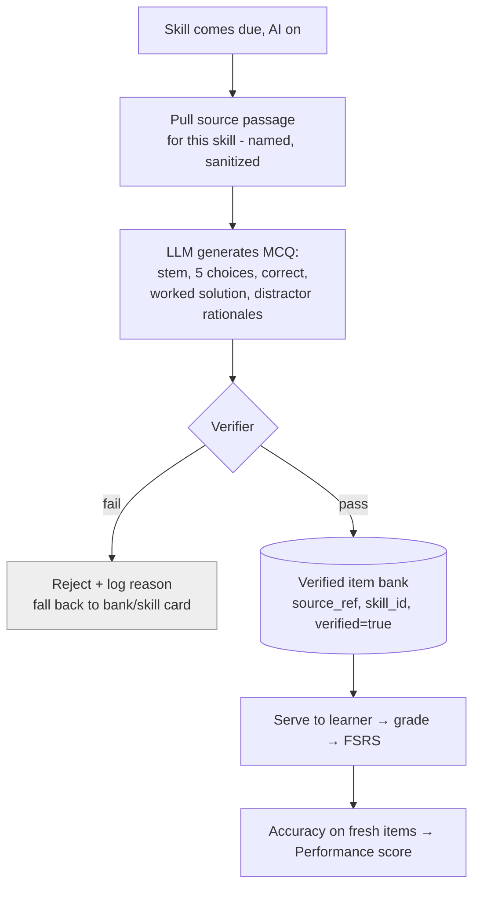

# Spec: AI problem generation + verification

> The Phase-2 layer that turns a due _skill_ into a fresh, verified, source-traced
> problem. Every AI output traces to a named source, passes a verifier before any
> student sees it, beats a simple baseline, and is persisted so the app still works
> with AI off. Companions: [`spec-engine`](spec-engine.md) (the skill it generates
> for), [`spec-scoring`](spec-scoring.md) (the performance signal it feeds), decision
> log D6, D14. **Status:** design locked, unbuilt.
>
> **Authority:** frozen initial design. For current truth read
> [`AGENTS.md`](AGENTS.md) + the decision log; a later decision overrides this doc
> where they conflict.

## 1. The problem this fills

Scheduling skills only matters if each review serves a _fresh_ instance — re-showing
the same problem teaches recognition of that problem, not the skill (D4). Phase 1
shows the skill name (self-graded); Phase 2 must generate genuine new problems
**without** making the runtime review path depend on a live model (the app must run
AI-off — assignment §2, D6).

## 2. Goals & non-goals

**Goals**

- Generate a fresh exam-style MCQ for a due skill (live LLM when online — D14).
- A **verifier** that blocks wrong, contradictory, or bad-teaching items before a
  student sees them.
- Every served item is **source-traced**, **persisted to a verified item bank**, and
  **replayable offline**.
- An **eval** vs a keyword/vector baseline on a ≥50-item gold set, with a pre-set
  cutoff (assignment 7f, §6 Fri).
- Prompt-injection defense (edge case #4).

**Non-goals**

- Generating on the runtime review path _required_ for the app to work — the bank +
  Phase-1 cards keep it functional AI-off (D6, PRD AC 23).
- A chatbot/tutor UI (not this phase).

## 3. Grounding

- Anki's engine is content-agnostic — it doesn't care whether the item is a typed
  flashcard or a generated MCQ, so the generation layer is additive
  ([`BRAINLIFT.md`](../../BRAINLIFT.md); D3).
- "AI must beat a simpler method" and "trace to a named source" are hard grading
  gates (assignment §2, 11) — so retrieval-from-a-source + verification is the design,
  not free-form generation.

## 4. The mechanic — generate → verify → bank



- **Source-grounded:** each skill maps to a named source (textbook section / authored
  note). The generator is _given_ that source and must produce an item whose answer
  is derivable from it — that's the traceable "named source" (assignment §2).
- **AI-off behavior:** if AI is disabled/offline/rate-limited/returns junk, the app
  serves the **pre-seeded verified bank** or the Phase-1 skill card — never blocks
  (edge case #10; D6). This is the base mode, not a silent fallback: the runtime path
  is bank-first by design.

## 5. The verifier (the safety gate)

An item is served only if it passes all of:

1. **Correctness** — an independent solver (symbolic/numeric check, e.g. SymPy, or a
   second-model cross-check) confirms exactly one choice is correct.
2. **Non-contradiction** — the stem/solution don't assert facts that conflict with
   the source or with another item (edge case #3).
3. **Teaching quality** — not vague/trivial/duplicate; distractors are plausible and
   each has a rationale (the "correct but bad teaching" count, 7f).
4. **Injection-safe** — source text is sanitized; instructions embedded in a source
   are ignored (edge case #4).

Items failing any check are dropped + logged (feeds the 7f counts).

## 6. Eval — gold set + baseline (assignment 7f)

- **Gold set:** ≥50 known-correct GRE-math Q&A pairs (held out, leakage-checked via
  [`spec-scoring`](spec-scoring.md) §5).
- **Generate-and-check:** generate 50 items from one real source; the verifier
  reports three counts — _correct & useful_, _wrong_ (worst), _correct but bad
  teaching_ — with a **passing cutoff set before looking** (7f).
- **Baseline:** a keyword/vector retrieval that returns the nearest existing item;
  Manifold's generate+verify must beat it on item correctness/usefulness on the
  held-out set, shown side-by-side (assignment §2, 11).
- **Eval runs before students see anything** (assignment §6 Fri): the cutoff blocks
  failing items at author time.

## 7. Data model

```
Item {
  id, skill_id, stem, choices[5], correct_index,
  solution, distractor_rationales[],
  source_ref,        // named source — required, traceable
  verified: bool, verifier_report,
  generated_by, generated_at
}
```

Items live in the verified bank (rides the collection so they sync, D9). A served
item records its `source_ref` for the "what evidence produced this" audit (assignment
§1).

## 8. UI surfaces

- Review screen swaps the Phase-1 skill card for a generated MCQ when AI is on; all
  math typeset. A small "source" affordance surfaces the named origin (traceability).
- An author/eval view (internal) shows the gold-set counts + baseline comparison.

## 9. Cold-start / the real risk

The real risk is an item that's _plausible but wrong_ slipping to a student (worse
than no card — assignment 7f). Mitigation: the verifier is mandatory and
independent of the generator, the cutoff is pre-set, and the bank only stores
`verified=true` items. Secondary risk: leaked gold items inflating the eval — gated
by the leakage script (must report clean before any number is trusted).

## 10. Content / ops

- Sources are catalogued per skill with license-clean provenance (AGPL/attribution,
  D17). Generation cost/latency is bounded by generating into the bank ahead of the
  due moment when online, not strictly per-review.

## 11. Acceptance criteria

1. A due skill (AI on) yields a fresh MCQ with stem/5 choices/correct/solution/
   distractor rationales, each tracing to a named source.
2. The verifier blocks wrong/contradictory/bad-teaching/injected items; rejects are
   logged.
3. The 7f run reports the three counts with a pre-set cutoff; failing items are
   blocked.
4. A side-by-side shows Manifold beats the keyword/vector baseline on held-out items.
5. Leakage script reports clean before the eval is reported.
6. With AI off/offline/rate-limited/returning junk, the app still serves items (bank/
   skill card) and still gives a score (PRD AC 10, 23; edge case #10).

## 12. Decisions & alternatives

**D6** (Phase-1 skill cards, generation deferred), **D14** (live LLM → verified
bank; templates retained as one generator class under the verifier). See
[`alternatives.md`](alternatives.md).

## 13. Out of scope (now), tracked

- A conversational tutor / step-level hinting (a later phase; VanLehn-style ITS).
- Auto-expanding the source corpus beyond the curated set.

## 14. Product phasing

- **Phase 1 (Wed):** none — no AI by rule (skill cards only).
- **Phase 2 (Fri):** generation + verifier + bank + eval vs baseline; performance
  signal goes live.
- **Phase 3 (Sun):** harden injection/robustness; finalize 7f counts + baseline
  report; confirm AI-off path in packaged builds.

---

<sub>Created with the `plan-prd` skill · maintained with `log`.</sub>
