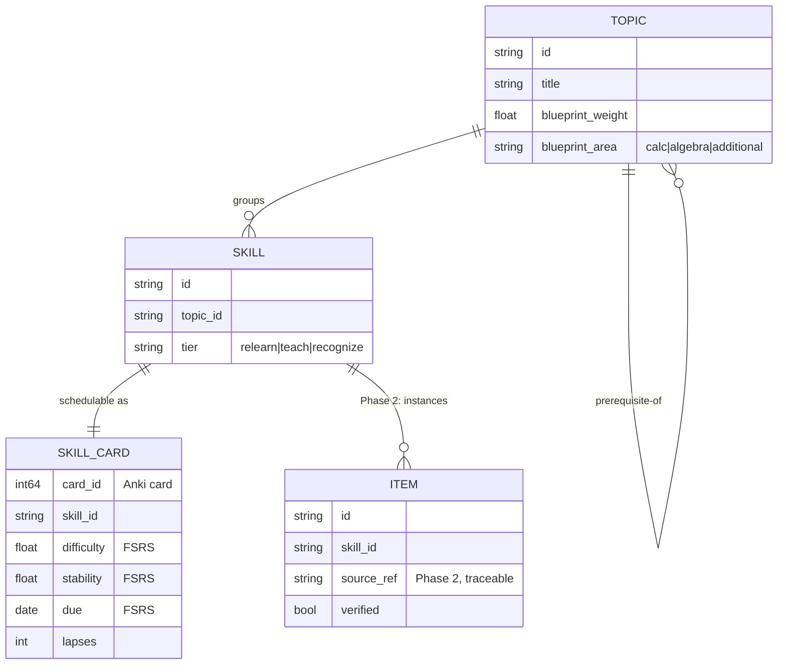

# Spec: Engine — the Rust change + skill/DAG data model

> How Manifold turns Anki's collection into a skill-scheduled GRE trainer and adds
> the one piece of real engine work the assignment demands. Covers the **skill/DAG
> data model**, the **review unit**, and the **Rust change**: a primary
> _mastery-by-topic query_ RPC plus a stretch _points-at-stake queue_. Lives in
> `rslib` (Rust), surfaced through `pylib` and the TS backend. Companions:
> [`spec-scoring`](spec-scoring.md), [`spec-mobile-sync`](spec-mobile-sync.md),
> decision log D3–D7. **Status:** design locked, unbuilt.
>
> **Authority:** frozen initial design. For current truth read
> [`AGENTS.md`](AGENTS.md) + the decision log; a later decision overrides this doc
> where they conflict.

## 1. The problem this fills

GRE math is _procedural_: the score comes from executing patterns on unseen
problems, not recalling facts. Anki schedules note/cards by recall; Manifold needs
to (a) schedule **skills** and (b) roll skill mastery up a **prerequisite DAG** into
per-topic stats fast enough to drive a live dashboard on 50,000 cards. Anki has
neither the skill abstraction nor a per-topic mastery rollup — and computing the
rollup outside Rust would be too slow and wouldn't satisfy "make a real change
inside Anki's Rust code" (D3, D7).

## 2. Goals & non-goals

**Goals**

- A skill/DAG data model layered onto Anki's existing notes/cards/tags with **no
  schema fork** (reuse tags + a small sidecar table) so sync (D9) keeps working.
- A `mastery_by_topic` backend RPC: per DAG node, `{mastered, total, avg_recall,
  avg_stability, coverage}`, p95 < 1 s on 50k cards (primary Rust change).
- A `points_at_stake` queue builder ordering due skills by `weight × weakness`
  (stretch Rust change).
- ≥3 Rust unit tests + 1 Python integration test; undo-safe; no corruption.

**Non-goals**

- Replacing FSRS or changing interval math (we _read_ FSRS state, we don't retune
  it — D3).
- Authoring the content itself (the DAG/skills are content work; this spec defines
  the _shape_ they take).
- The scores themselves (owned by [`spec-scoring`](spec-scoring.md)); this spec
  only provides the fast aggregates they consume.

## 3. Grounding

- FSRS already estimates per-card recall well (assignment §1); we build _on_ it, not
  beside it (D3). The memory→performance→readiness bridge is the new work, and it
  starts from a trustworthy per-skill mastery signal.
- "Belongs in Rust" rationale: a per-topic rollup over 50k cards is a hot,
  latency-bound aggregation behind a p95<1s dashboard (PRD §7) — exactly the work
  that must not cross the Python/TS boundary per request. The one-page "why Rust"
  note (assignment 7a) derives from this section.

## 4. The mechanic — skills, the DAG, and the review unit

- A **Skill** is a fine-grained pattern (`calc.related_rates.similar_triangles`),
  the grain FSRS schedules (D4). Each skill belongs to exactly one **DAG node**
  (topic) and carries a **tier** (`relearn | teach | recognize`, D5).
- A **Topic (DAG node)** has a `blueprint_weight` (its share of exam points) and
  prerequisite edges to other nodes. The DAG is acyclic; `coverage` = fraction of
  in-scope nodes that have ≥1 authored skill (the coverage map, assignment 7c).
- The **review unit** is a per-`(user, skill)` schedulable card. In Phase 1 its
  rendered front is the skill name (self-graded); in Phase 2 a generated problem is
  shown for it (D6, D14). FSRS state lives on the card exactly as in Anki — we add
  no parallel scheduler.



### Storage choice (no schema fork)

- **Topic/skill identity** rides on Anki **tags** (`mf::topic::series`,
  `mf::skill::ratio_test`, `mf::tier::teach`) so it syncs with the collection for
  free (D9).
- The **DAG edges + blueprint weights** live in a small versioned content file
  (`mf_blueprint.json`) shipped with the deck, loaded into an in-memory graph in
  Rust at collection open — static reference data, not per-user state.
- This means the Rust change adds **read/aggregation logic**, not new synced
  tables — the lowest-risk way to touch the engine and keep sync/undo intact (D7).

## 5. The Rust change — algorithms & interfaces

### 5.1 Primary: `mastery_by_topic` (RPC)

Walks due/seen cards once, buckets by topic via the in-memory DAG, and rolls up.

```rust
// rslib/src/manifold/mastery.rs  (new module)
pub struct TopicMastery {
    pub topic_id: String,
    pub mastered: u32,     // skills with recall ≥ mastery_threshold
    pub total: u32,        // authored skills in this topic
    pub avg_recall: f32,   // mean FSRS R over the topic's cards
    pub avg_stability: f32,
    pub coverage: f32,     // authored / blueprint-expected
}

pub fn mastery_by_topic(col: &mut Collection, threshold: f32)
    -> Result<Vec<TopicMastery>>;
```

- Single pass over the card table; FSRS `R` computed from existing memory state +
  elapsed time (reusing Anki's FSRS functions — no reimplementation).
- Returned to Python/TS via a new protobuf RPC (§5.3). The dashboard and
  [`spec-scoring`](spec-scoring.md) consume it; nothing recomputes per-card in
  Python/TS.

### 5.2 Stretch: `points_at_stake` queue

A new due-card ordering: `priority = blueprint_weight(topic) × weakness(skill)`,
where `weakness = 1 − R`. Highest-value-at-risk skills surface first (PRD §6).

- Implemented as an alternative queue-builder behind a flag, **leaving FSRS
  intervals untouched** (it reorders _what's already due_, it doesn't reschedule) —
  this is what keeps undo + interval validity safe (D7).

### 5.3 Protobuf surface

```proto
// proto/anki/manifold.proto  (new)
service ManifoldService {
  rpc MasteryByTopic(MasteryRequest) returns (MasteryResponse);
  rpc BuildPointsAtStakeQueue(QueueRequest) returns (QueueResponse);
}
message MasteryRequest { float mastery_threshold = 1; }
message TopicMastery {
  string topic_id = 1; uint32 mastered = 2; uint32 total = 3;
  float avg_recall = 4; float avg_stability = 5; float coverage = 6;
}
message MasteryResponse { repeated TopicMastery topics = 1; }
```

`pylib/_backend.py` exposes `mastery_by_topic(...)`; the TS `@generated/backend`
module gets it for the Svelte dashboard (D10). New `.proto` ⇒ a full `just check`
build is required.

## 6. The key screen

The aggregates power the **Readiness dashboard** coverage map and the three scores
([`spec-scoring`](spec-scoring.md)). The non-negotiable element: the dashboard reads
**only** from `mastery_by_topic` (one RPC), so first load is p95 < 1 s and refresh
< 500 ms without freezing (PRD §7).

## 7. Data model details & scaling

- 50k cards × single-pass rollup is O(n); the DAG is ~17 nodes, so bucketing is
  trivial. Memory: reuse the open collection; no full materialization.
- Honest limit: `avg_recall` uses FSRS `R` at query time; for skills with almost no
  history, R is low-confidence — surfaced to scoring as wide bands, not hidden
  (edge case #6; D12).

## 8. UI surfaces

- New mediasrv page `dashboard.html` (Svelte) calls `mastery_by_topic` (D10).
- Review screen reuses Anki's reviewer; Phase 1 renders skill-name cards, Phase 2
  swaps in a generated item ([`spec-ai-generation`](spec-ai-generation.md)).

## 9. Cold-start / the real risk

The biggest risk is the **build**, not the feature: compiling Anki from source,
making a Rust change appear in the desktop app, and getting the same engine on the
phone (assignment "Get Anki Building First", D8). Mitigation: land a trivial Rust
change end-to-end on day one before building `mastery_by_topic`.

## 10. Content / ops

- The skill taxonomy + DAG are authored against the ETS blueprint and audited for
  coverage (assignment 7c). The blueprint file is versioned; a missing high-weight
  topic must show as low coverage, never as silent "ready" (edge case #2).

## 11. Acceptance criteria

1. `mastery_by_topic` returns correct per-topic rollups on a seeded fixture
   (pure-function unit tests, ≥3 Rust tests covering: empty topic, partial mastery,
   coverage < 1).
2. One Python integration test calls the RPC through `_backend` and asserts the
   rollup matches a hand-computed fixture.
3. Undo of a review leaves mastery + collection consistent (test + manual).
4. p95 < 1 s for `mastery_by_topic` on the 50k benchmark deck (assignment 7h).
5. Stretch: `points_at_stake` orders a fixture queue by `weight × (1−R)` and leaves
   FSRS `due`/intervals unchanged (test).
6. A one-page "why this belongs in Rust" note + a list of touched upstream files
   with merge-difficulty notes exists (assignment 7a).

## 12. Decisions & alternatives

Engine decisions live in the log: **D3** (build on the engine), **D4** (skill-level
scheduling), **D5** (DAG + tiers), **D6** (Phase-1 review surface), **D7** (the Rust
change: mastery query primary + points-at-stake stretch). See
[`alternatives.md`](alternatives.md).

## 13. Out of scope (now), tracked

- Topic-aware _rescheduling_ (moving FSRS due dates by weakness) — deferred; riskier
  to interval validity/undo (noted in D7).
- A synced skill table (we ride tags instead) — revisit only if tag scaling bites.

## 14. Product phasing

- **Phase 1 (Wed):** data model + `mastery_by_topic` + Memory score + undo-safe +
  installer; phone runs the same engine.
- **Phase 2 (Fri):** `points_at_stake` queue; aggregates feed performance/readiness.
- **Phase 3 (Sun):** benchmark RPC latency; crash/corruption tests.

---

<sub>Created with the `plan-prd` skill · maintained with `log`.</sub>
