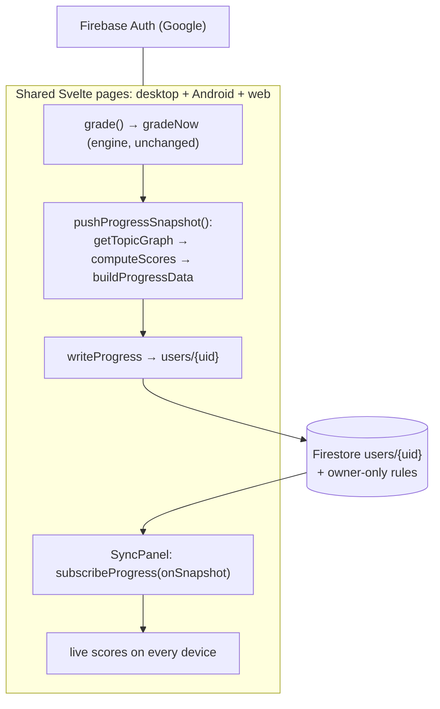

# Spec: Firebase Google login + real-time progress mirror

> Google identity + live cross-device progress, added on top of the existing
> engine (decision **D45**, extends **D9**). Manifold keeps the Anki collection
> (cards/revlog) as the scheduling source of truth, still synced by Anki's own
> protocol; Firebase carries only a small, **derived** progress read-model so a
> signed-in learner sees the same live scores on every device.
>
> Companions: [`sync.md`](sync.md) (Anki collection sync), decision log **D45**,
> Android runbook `~/Desktop/manifold-droid/DEPLOY-ANDROID.md`.
> Firebase project: **`manifold-gre`**.

## 1. What this is (and is not)

- **Is:** Firebase Auth (Google) for identity + a Firestore document per user
  holding the three honest scores + per-topic mastery, updated in real time.
- **Is not:** a replacement for Anki sync. It never writes FSRS/cards/revlog and
  never feeds back into scheduling. It is a **mirror**, read-only w.r.t. the
  collection (it only _reads_ `getTopicGraph`, exactly like the dashboard).

Rationale for the mirror (not event-replay) approach: re-piping the full
collection through Firestore re-implements Anki sync and fights FSRS's need for a
consistent local SQLite. The mirror delivers the visible outcome — "study on
device A, watch device B update live" + Google login — additively and safely.

## 2. Architecture

Files (all under `ts/lib/manifold/` unless noted):

- `firebase.config.ts` — public web config (committed; not a secret) + fail-loud guard.
- `firebase.ts` — init, auth state, environment-aware Google sign-in, `writeProgress`,
  `subscribeProgress`.
- `progress.ts` — pure shaping of the snapshot from `ScoreReport` + topic graph.
- `sync.ts` — `pushProgressSnapshot()` (engine RPC → scores → Firestore) with an
  in-flight/interval guard; surfaces real errors (no silent fallback).
- `SyncPanel.svelte` — the dashboard sign-in button, user chip, and live remote readout.
- Wiring: `routes/manifold/+page.svelte` (SyncPanel), `routes/manifold-session/+page.svelte`
  (push after each graded answer).
- Desktop native: `qt/aqt/mediasrv.py::manifold_google_sign_in` (system-browser loopback).
- Android native: `manifold-droid/.../pages/ManifoldPage.kt` (Credential Manager bridge).
- Rules/config: `manifold/firebase/{firestore.rules,firebase.json,.firebaserc}`.

## 3. Data model

Collection `users`, document id `{uid}` (== `request.auth.uid`), overwritten on each
push (a mirror, not an append log):

| field                     | type      | notes                                    |
| ------------------------- | --------- | ---------------------------------------- |
| `uid`                     | string    | == auth uid == doc id; immutable         |
| `schemaVersion`           | int       | `1`                                      |
| `updatedAt`               | timestamp | server time; must be recent              |
| `platform`                | string    | `desktop` \| `android` \| `web`          |
| `deviceId`                | string    | opaque per-install id (≤64)              |
| `appVersion`              | string    | ≤40                                      |
| `coverage`                | number    | 0..1, blueprint-weighted                 |
| `totalIndependentReviews` | int       | ≥0                                       |
| `readinessState`          | string    | `projected` \| `abstaining`              |
| `memory`, `performance`   | map       | `{present, value, low, high}`            |
| `readiness`               | map       | compact projected range or evidence-owed |
| `topics`                  | list      | ≤64 small per-topic mastery entries      |

## 4. Sign-in per shell

Google blocks its OAuth consent screen inside embedded webviews
(`disallowed_useragent`), so the flow adapts (`detectShell()` in `firebase.ts`):

- **Web (real browser):** `signInWithPopup`.
- **Desktop (Qt webview):** the page POSTs `/_anki/manifoldGoogleSignIn`; Python opens
  the OS browser to a one-shot **loopback** page (`http://localhost:41599`) that runs the
  normal popup, harvests the **Google ID token**, and posts it back; the webview then
  calls `signInWithCredential`. No secret, no extra OAuth client — uses the public web
  config and `localhost` (an authorized domain).
- **Android (AnkiDroid webview):** `ManifoldPage` injects a `ManifoldAndroidAuth` JS
  interface; `startGoogleSignIn()` runs **Credential Manager** with the web client as
  `serverClientId`, then resolves the Google ID token back to the webview, which calls
  `signInWithCredential`.

All three end in the same `signInWithCredential(GoogleAuthProvider.credential(idToken))`
whose `aud` is the project web client — exactly what Firebase expects.

## 5. Security rules

Owner-only (`manifold/firebase/firestore.rules`): a user can only read/write their own
document. Strict schema (`hasOnly`+`hasAll`), type checks, string/list size caps,
immutable `uid`, and a recent-`updatedAt` window. Validated on **both** create and
update (each write is a full overwrite). The web apiKey is public by design; security is
the rules + authorized domains, not hiding config.

## 6. Provisioning (already done for `manifold-gre`)

- Project, web app, Firestore (nam5, native), Google auth provider, and rules are
  provisioned; `localhost` is an authorized domain (desktop loopback).
- Android app `com.ichi2.anki.debug` registered with the debug SHA-1 (Credential
  Manager). Add the release package/SHA-1 the same way before shipping the release APK.

Re-deploy rules: `cd manifold/firebase && npx -y firebase-tools@latest deploy --only firestore:rules`.

## 7. Verification

- **Emulator E2E (real rules)** — `manifold/firebase/verify_sync.mjs`, run via
  `firebase emulators:exec` (needs Java): **5/5 pass** — real-time `onSnapshot`
  propagation across two clients of one user, cross-user read denied, cross-user write
  denied, schema-pollution rejected, owner can read own doc.
- **Web bundle** — `yarn build` succeeds with Firebase integrated; `svelte-check` clean.
- **Desktop** — mechanism in place; final check is an interactive Google consent in the
  system browser (loopback).
- **Android** — bridge + deps coded and the Firebase app/SHA-1 provisioned; **rebuild
  the APK** (`bash ~/Desktop/manifold-droid/redeploy.sh`, backend `anki/package.json`
  now lists firebase) and complete one on-device Google sign-in to verify end to end.

## 8. Out of scope (tracked)

- **Event-replay scheduling sync** (Firebase as the scheduling backbone). Larger, and
  would supersede D9; deliberately not built (see D45).
- App Check / abuse hardening; multi-provider login (Apple, email) — straightforward
  follow-ups on the same layer.
