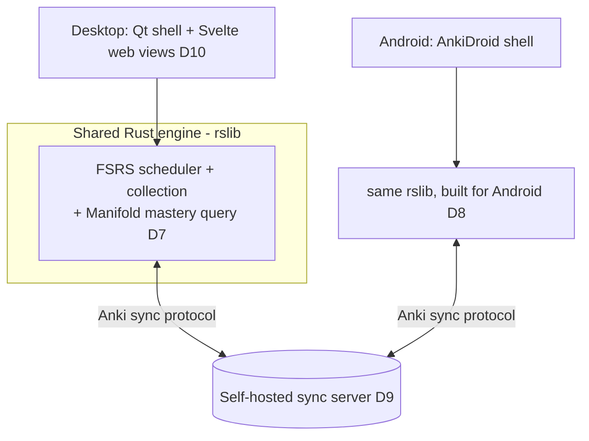
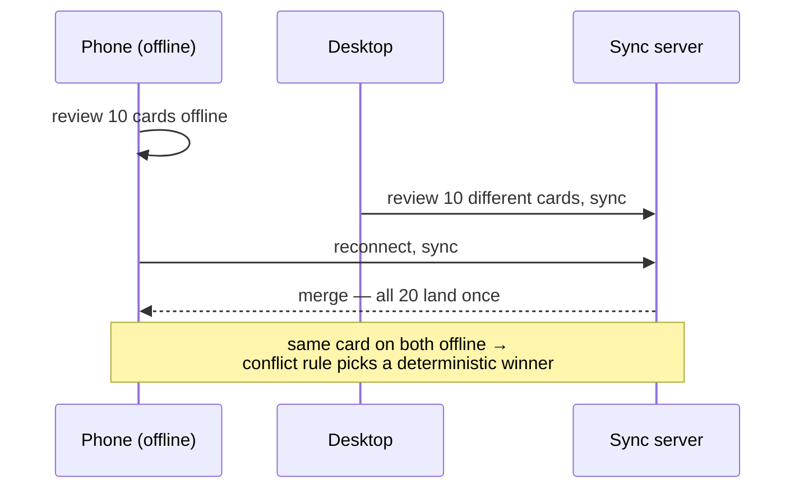

# Spec: Mobile companion + sync

> The phone half of "two apps, one engine." Manifold's Android companion is built on
> AnkiDroid so it runs the _same_ Rust backend (carrying our engine change, D7), and
> reviews flow both ways through Anki's existing sync protocol against a self-hosted
> server. Companions: [`spec-engine`](spec-engine.md),
> [`spec-scoring`](spec-scoring.md), decision log D8–D9. **Status:** design locked,
> unbuilt.
>
> **Authority:** frozen initial design. For current truth read
> [`AGENTS.md`](AGENTS.md) + the decision log; a later decision overrides this doc
> where they conflict.

## 1. The problem this fills

The assignment requires a phone companion that **shares the engine** and syncs —
not a reimplementation. Rewriting the scheduler in Swift/JS explicitly does not
count (assignment §3, D3). We need the lowest-risk path to a genuinely shared Rust
engine + correct two-way sync in one week.

## 2. Goals & non-goals

**Goals**

- An Android build that runs Anki's Rust backend **with our change** on-device (D8).
- Real review sessions on the same GRE deck as desktop (Phase 1).
- Two-way sync, offline-then-reconnect, no lost/double-counted reviews (Phase 2).
- A documented, correct conflict rule (assignment 7b).
- The three scores + give-up rule on the phone (D11, D12).

**Non-goals**

- iOS (D8, out of scope this release).
- A custom sync protocol (D9).
- Real-time sub-second push sync (assignment §13 stretch only).

## 3. Grounding (product scan)

AnkiDroid is AGPL and already integrates Anki's Rust backend via the Rust bridge, so
our `rslib` change ships to it without a rewrite — the shared-engine requirement is
met _by construction_, not by parallel code (D8). Anki's sync protocol is battle-
tested for offline study + reconnection across millions of users, which is exactly
the reliability the sync test (7b) probes.

## 4. The mechanic — one engine, two shells

- Both shells call the identical `rslib`; the Manifold change is in `rslib`, so both
  inherit it.
- New UI surfaces are Svelte mediasrv pages (D10), reused on Android's WebView where
  feasible so the dashboard/review loop don't fork.

## 5. Sync & the conflict rule

- **Normal case:** disjoint reviews merge; all land exactly once (assignment 7b
  first half).
- **Conflict rule (stated):** when the _same_ card was reviewed on both devices
  offline, the review with the **later real-world review timestamp wins**; the loser
  is recorded in the revlog but does not double-count the card's scheduling. We
  document this as Manifold's rule and demonstrate a clear, correct winner (7b
  second half). Anki's collection-level sync semantics are the substrate; this rule
  is what we write down and test.
- **Clock skew:** timestamps are normalized to the server's clock on sync to defend
  against a wrong phone clock (edge case #12).

## 6. The key screen

The phone runs the same review loop + dashboard. Non-negotiable: a card reviewed on
the phone appears on the desktop after sync (and vice-versa) with the counts intact
— the literal demo the assignment asks to record (Phase 2 proof).

## 7. Data model

No mobile-specific schema: the collection, FSRS state, and Manifold tags
([`spec-engine`](spec-engine.md) §4) are the synced unit. The blueprint/DAG file
ships in the deck/app assets, identical on both platforms.

## 8. UI surfaces

- Android: AnkiDroid reviewer + a WebView dashboard reusing `dashboard.html`.
- Parity requirement: three scores + ranges + give-up rule render identically (D11).

## 9. Cold-start / the real risk

Getting our modified `rslib` to **build for Android** inside AnkiDroid is the risk
(cross-compilation + the bridge), and teams that defer it lose. Mitigation: build the
Android engine on day one with a trivial change before wiring features (D8;
assignment "Get Anki Building First").

## 10. Content / ops

- One sync server instance for the demo; document setup so the test is re-runnable.
- The 50k benchmark deck must also load + review on a mid-range phone within the perf
  budget (PRD §7).

## 11. Acceptance criteria

1. Android build runs on a real device/emulator, loads the GRE deck, runs a real
   review on the shared `rslib` (Phase 1; two-way sync not yet required).
2. Review 10 on phone offline + 10 on desktop, reconnect → all 20 present, none lost
   or doubled (7b).
3. Same card reviewed on both offline → the documented conflict rule picks one clear,
   correct winner; shown in a recording (7b).
4. Offline review syncs on reconnect; phone offline mid-sync resumes cleanly (edge
   case #12).
5. The three scores + give-up rule appear on the phone (D11, D12).
6. Sync of a normal session completes < 5 s (PRD §7).
7. Crash mid-review on the phone → 0 corrupted collections (assignment 7g).

## 12. Decisions & alternatives

**D8** (Android via AnkiDroid), **D9** (reuse Anki sync). See
[`alternatives.md`](alternatives.md).

## 13. Out of scope (now), tracked

- iOS via FFI (D8) — a fast-follow.
- Real-time sync + E2E-encrypted/CRDT merge (assignment §13 stretch).

## 14. Product phasing

- **Phase 1 (Wed):** Android runs the shared engine + reviews the same deck.
- **Phase 2 (Fri):** two-way sync + offline + three scores on phone.
- **Phase 3 (Sun):** conflict + crash tests; packaged signed APK.

---

Created with the `plan-prd` skill · maintained with `log`.
