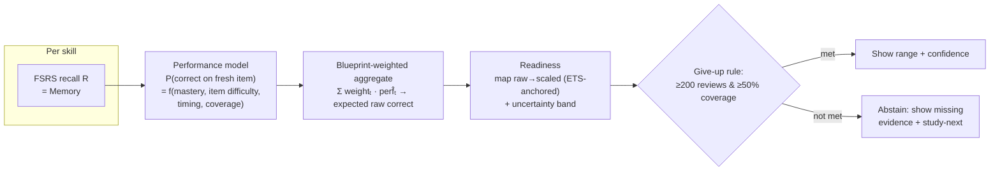
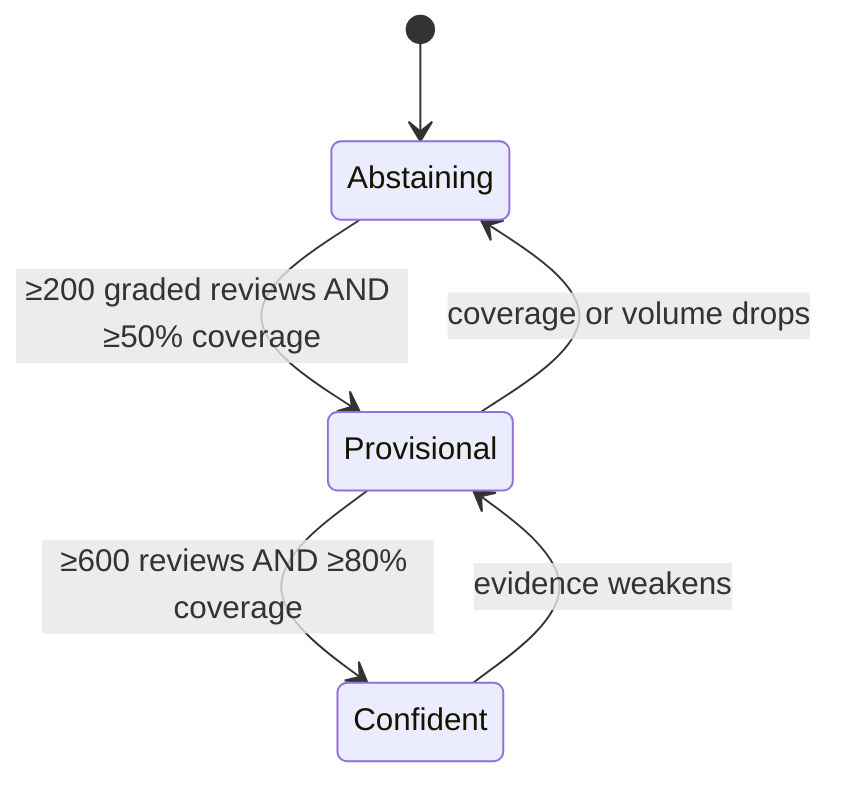

# Spec: Scoring — memory, performance, readiness

> Three separate, honest scores — never blended — each shown with a range, the
> evidence behind it, and a rule for when Manifold refuses to answer. This is the
> spec the assignment grades hardest (20%, plus an automatic fail for a fabricated
> readiness number). Consumes the fast aggregates from
> [`spec-engine`](spec-engine.md); rendered on the dashboard (D10). Companions:
> [`spec-ai-generation`](spec-ai-generation.md) (provides the performance signal),
> decision log D11–D13. **Status:** design locked, unbuilt.
>
> **Authority:** frozen initial design. For current truth read
> [`AGENTS.md`](AGENTS.md) + the decision log; a later decision overrides this doc
> where they conflict.

## 1. The problem this fills

The app must answer three _different_ questions (assignment §1): can the student
recall a fact (**memory**), answer a new exam-style question (**performance**), and
what would they score (**readiness**) — with honest uncertainty. FSRS gives memory;
the two bridges (memory→performance, performance→score) are the new work, and the
easiest way to fail is to blend them or to show a confident number with nothing
behind it (D11).

## 2. Goals & non-goals

**Goals**

- Compute and display three scores, each with a point estimate **and** a range.
- Enforce the **give-up rule**: no readiness number below a stated evidence line
  (D12).
- A readiness→scaled-score mapping that is **anchored to the real ETS
  distribution** and reported as a range, with the method written down (D13).
- Calibration, paraphrase, and leakage evidence (assignment §6, 7d, 7e, 9).

**Non-goals**

- Validating readiness against real students' practice-test scores (Step 4 bonus,
  out of scope — D11).
- Inventing a precise scaled number (forbidden — D13).

## 3. Grounding (the real numbers)

- **Memory** = FSRS recall probability — Anki's evidenced core; we only need to show
  it's _calibrated_ (assignment §9 Step 1).
- **Performance ≠ memory** is the whole point: measured in-session recall does not
  track exam-style performance, and a good app surfaces that gap rather than hiding
  it ([`BRAINLIFT.md`](../../BRAINLIFT.md) Insight 2; Roediger & Karpicke 2006;
  Rohrer & Taylor 2007).
- **Readiness scale** — official ETS GRE Math Subject Test distribution (2019–2023,
  n=7,452): **mean 676, SD 154**, scale 200–990 (effective ~380–960). Anchor
  percentiles (percent scoring _below_):

| Scaled | %ile |  Scaled |   %ile | Scaled | %ile |
| -----: | ---: | ------: | -----: | -----: | ---: |
|    900 |   93 |     740 |     62 |    580 |   30 |
|    860 |   86 |     700 |     54 |    540 |   22 |
|    820 |   77 | **680** | **50** |    500 |   14 |
|    800 |   74 |     660 |     46 |    460 |    7 |
|    780 |   70 |     620 |     38 |    420 |    3 |

The ceiling is compressed (960 ≈ 96th pct) — which is _why_ the median (~680) is the
honest target and the top tail is out of scope (D2). Full table in
`mf_blueprint.json`.

## 4. The mechanic — three scores

### 4.1 Memory

`R` from FSRS per skill; topic/overall via the `mastery_by_topic` rollup
([`spec-engine`](spec-engine.md)). Displayed as a value + band (per-skill variance).

### 4.2 Performance

`perf̂(skill) = σ(β₀ + β₁·stability + β₂·(1−difficulty) + β₃·avg_time_z + β₄·tier)`
— a calibrated logistic over features available without AI, fit on **held-out**
graded items once Phase 2 exists. Until then, Performance is shown as "not yet
measured" rather than copied from Memory (D11). The **paraphrase test** (§5) is how
we prove it isn't just echoing memory.

### 4.3 Readiness

1. Expected raw correct `E[raw] = Σ_topics blueprint_weightₜ · perf̂ₜ · Qₜ`
   (`Qₜ` = questions in topic t; rights-only scoring, no penalty — D1).
2. Map `E[raw]` → scaled via a monotonic function anchored on ETS (mean 676 ≈ 50%);
   raw→scaled tables aren't published, so this is an **explicit approximation**
   (D13).
3. Uncertainty band from per-skill variance + a coverage penalty (less covered ⇒
   wider band). Display: point + range + % covered + confidence + last-updated +
   top reasons (assignment §4).

> Example display (the required shape, not a bare number):
> **Projected: 540–600 (point 570)** · confidence **low** · **38%** covered ·
> updated 2m ago · _driver: weak on series & linear algebra_.

## 5. Calibration, paraphrase, leakage (the proof)

- **Calibration (Step 1, required):** reliability diagram + **Brier / log-loss** on
  held-out reviews; when Memory says 80%, ~80% should recall. Owned here, charted on
  the dashboard.
- **Paraphrase test (7d):** for 30 skills, author 2 reworded exam-style items each;
  compare card recall vs reworded accuracy. If they're ~equal, Performance is just
  copying Memory — report the **gap** honestly (D11).
- **Leakage check (7e):** a script scans the generation/training inputs for any
  gold-set item or near-duplicate (normalized text + embedding similarity) and must
  report clean before any eval number is trusted (ties to
  [`spec-ai-generation`](spec-ai-generation.md)).

## 6. The key screen

The **Readiness dashboard**: three score cards (each value+range), the coverage map,
and the give-up state. The non-negotiable element: when below the line, the
readiness card shows **missing evidence + the single best next skill**, never a
number (D12; PRD AC 21).

## 7. Data model

- Scores are **derived**, not stored as truth: computed from FSRS state + the item
  bank's graded attempts via `mastery_by_topic`. A small cache row holds the last
  computed readiness + inputs for "last updated" + audit ("what evidence produced
  the number", assignment §1).

## 8. UI surfaces

- `dashboard.html` (Svelte mediasrv page, D10), shared by desktop + phone (D8). All
  math typeset (KaTeX). Same three scores + give-up rule on both (assignment §3).

## 9. Cold-start / the real risk

The real risk is dishonesty creep — showing a number that _looks_ precise. Mitigation
is structural: readiness is **physically gated** behind the give-up rule and always
rendered as a range with its evidence; there is no code path that emits a bare
scalar (PRD AC 20, 21).

## 10. Give-up rule (stated, per assignment §4)

Manifold shows **no readiness score** until ≥200 graded reviews **and** ≥50%
blueprint coverage; "confident" widens the bar (D12). Thresholds are chosen, not
derived — flagged for revision with data.

## 11. Acceptance criteria

1. Memory shows value + band per skill/topic/overall; a calibration chart + Brier/
   log-loss render on held-out reviews.
2. Performance is computed only from held-out items and shown with a range; below
   data it reads "not yet measured", never equals Memory.
3. The paraphrase test reports the memory↔performance gap over ≥30 skills.
4. Readiness shows point + range + % covered + confidence + last-updated + top
   reasons; **never** a bare number (negative AC).
5. Below the give-up line, no readiness number appears — only missing-evidence +
   study-next (PRD AC 21).
6. The readiness mapping method is documented (this spec §4.3) and uses the ETS
   anchors (§3).
7. The leakage script reports clean before any eval is trusted.

## 12. Decisions & alternatives

**D11** (three separate scores), **D12** (give-up rule thresholds), **D13**
(readiness→scale mapping). See [`alternatives.md`](alternatives.md).

## 13. Out of scope (now), tracked

- Real-student readiness validation (Step 4 bonus) — needs longitudinal study data
  we can't gather in a week (D11, D13).
- An IRT/adaptive difficulty model — Phase 3+ if performance calibration demands it.

## 14. Product phasing

- **Phase 1 (Wed):** Memory score + range + give-up rule (readiness abstains: no
  performance signal yet).
- **Phase 2 (Fri):** Performance from generated items; readiness goes live with
  range; three scores on the phone.
- **Phase 3 (Sun):** calibration chart + Brier/log-loss; paraphrase + leakage
  reports; written mapping.

---

Created with the `plan-prd` skill · maintained with `log`.
