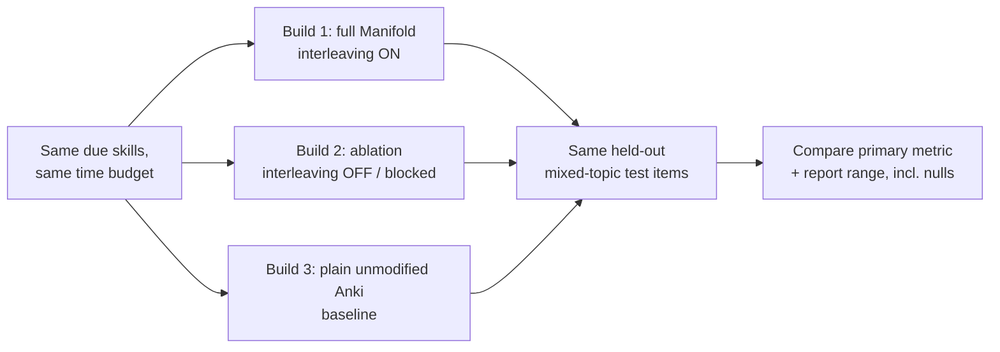

# Spec: Study feature + ablation — interleaving

> The one learning-science feature Manifold puts on trial. We pre-register what
> interleaving should do, then run a fair three-build experiment that _could_ show
> it doesn't. A null result is a real, reportable outcome. Companions:
> [`spec-engine`](spec-engine.md) (the queue interleaving reorders),
> [`spec-scoring`](spec-scoring.md) (the outcome measure), decision log D15.
> **Status:** design locked, unbuilt.
>
> **Authority:** frozen initial design. For current truth read
> [`AGENTS.md`](AGENTS.md) + the decision log; a later decision overrides this doc
> where they conflict.

## 1. The problem this fills

The assignment requires picking one learning-science feature, writing down what it
should do, and testing it by turning it off and on (assignment §8). Manifold's
thesis rests on _method beats volume_, so the feature must be one of the methods the
[`BRAINLIFT.md`](../../BRAINLIFT.md) is built on — and one with a clean on/off toggle.

## 2. Goals & non-goals

**Goals**

- Implement **interleaving** (mix skills across topics within a session) as a
  toggleable session-builder over the due queue.
- Run the three-build comparison at **equal study time** with a **pre-registered**
  primary metric.
- Report results honestly, including null/negative (assignment §8).

**Non-goals**

- Proving interleaving works — only running a fair test that _could_ falsify it.
- Testing more than one feature (others deferred — D15).

## 3. Grounding (why interleaving)

- **Rohrer & Taylor (2007):** mixed (interleaved) math practice was ~**250%** better
  on a one-week test than blocked practice, even though mixing _lowered_ in-session
  accuracy — a math-specific, domain-matched result ([`BRAINLIFT.md`](../../BRAINLIFT.md)
  Insight 2 / Subcat 2.2).
- It shares the "desirable difficulty" mechanism with retrieval practice: the harder-
  feeling session builds the durable, transferable skill the exam tests — exactly the
  memory↔performance bridge ([`spec-scoring`](spec-scoring.md)).
- Clean toggle: interleaving is purely a **queue-ordering** policy, so the ablation
  changes one variable and nothing else.

## 4. The mechanic

- **Interleaving ON (full Manifold):** the session builder draws due skills so
  consecutive items come from _different_ DAG topics (round-robin across topics
  within the due set), composing with the points-at-stake ordering
  ([`spec-engine`](spec-engine.md) §5.2).
- **Interleaving OFF (ablation):** the same due skills are served **blocked** —
  grouped by topic, one topic exhausted before the next.
- Both draw from the identical due set + study-time budget, so only the _order_
  differs.

## 5. The experiment (assignment §8)

- **Three builds:** (1) full app, (2) feature off, (3) plain Anki — so we can tell a
  feature effect (1 vs 2) apart from a whole-app effect (vs 3) (assignment §8).
- **Pre-registered hypothesis (stated before results):** _"Interleaving raises
  accuracy on new mixed-topic items at equal study time."_
- **Primary metric (pre-registered):** accuracy on a held-out set of mixed-topic
  exam-style items, measured after a fixed retention delay.
- **Controls:** same learners (or matched cohorts), same items, same time budget
  (assignment §8). Report a **range**, not a point, and report failure-to-replicate.
- **Honesty:** "interleaving made no difference here" scores as a real result;
  "feels better" scores nothing (assignment §8).

## 6. The key screen

A session-settings toggle (interleave vs blocked) and an internal results view
showing the three-build comparison with confidence intervals. Non-negotiable: the
pre-registered metric + hypothesis are recorded **before** the run.

## 7. Data model

- A session-builder policy flag (`interleave: bool`) on the study session; the held-
  out test set is a tagged item subset never used in practice (leakage-checked,
  [`spec-scoring`](spec-scoring.md) §5).

## 8. UI surfaces

- Session settings (desktop + phone); results view (internal). No new synced schema.

## 9. Cold-start / the real risk

A one-week study has small N and a short retention window, so the test may be
under-powered → null. Mitigation: pre-register the metric, fix the time budget, and
report the effect **with its range** so an honest null is interpretable rather than
spun (assignment §8).

## 10. Content / ops

- The held-out mixed-topic test items reuse the gold-set discipline
  ([`spec-ai-generation`](spec-ai-generation.md) §6) and must pass the leakage check.

## 11. Acceptance criteria

1. Interleaving is a working on/off toggle over the due queue (one variable).
2. Three builds run at equal study time: full / feature-off / plain Anki.
3. The hypothesis + primary metric are recorded before results exist.
4. Results report the metric with a range, including any null/negative outcome.
5. The test items are held out + leakage-checked.

## 12. Decisions & alternatives

**D15** (interleaving as the ablation feature; successive relearning + generative
variation deferred). See [`alternatives.md`](alternatives.md).

## 13. Out of scope (now), tracked

- Ablating successive relearning or generative variation (D15) — later experiments.
- Multi-week longitudinal designs (needs more time than the speedrun allows).

## 14. Product phasing

- **Phase 1–2:** ship the interleaving toggle (it's just queue ordering).
- **Phase 3 (Sun):** run + report the three-build experiment with the pre-registered
  metric.

---

Created with the `plan-prd` skill · maintained with `log`.
